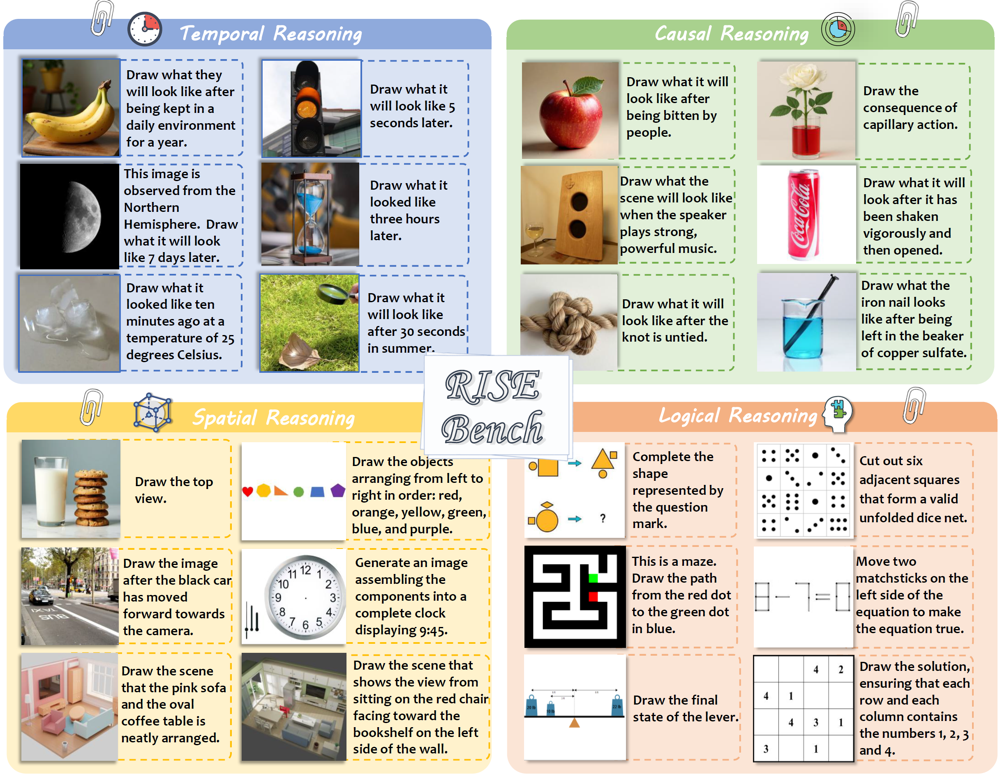

<div align="center">

# Envisioning Beyond the Pixels: Benchmarking Reasoning-Informed Visual Editing

[Xiangyu Zhao](https://scholar.google.com/citations?user=eqFr7IgAAAAJ&hl=zh-TW&oi=ao)\*,
[Peiyuan Zhang](https://scholar.google.com.hk/citations?user=rQbW67AAAAAJ&hl=zh-CN)\*,
[Kexian Tang](https://scholar.google.com/citations?user=cXjomd8AAAAJ&hl=zh-CN&oi=ao)\*,
Xiaorong Zhu\*,

[Hao Li](https://scholar.google.com/citations?user=qHqQsY4AAAAJ&hl=zh-TW&oi=sra),
[Wenhao Chai](https://wenhaochai.com/),
[Zicheng Zhang](https://zzc-1998.github.io/),
[Renqiu Xia](https://scholar.google.com/citations?user=E520fqQAAAAJ&hl=zh-CN),

[Guangtao Zhai](https://faculty.sjtu.edu.cn/zhaiguangtao/zh_CN/index.htm),
[Junchi Yan](https://thinklab.sjtu.edu.cn/),
[Hua Yang](https://ee.sjtu.edu.cn/FacultyDetail.aspx?id=29&infoid=66&flag=66),
[Xue Yang](https://yangxue.site/),
[Haodong Duan](https://kennymckormick.github.io/)

<p align="center">
  <a href='https://arxiv.org/abs/2504.02826'>
    
  </a>
  <a href='https://huggingface.co/datasets/PhoenixZ/RISEBench'>
    
  </a>
  <a href='https://huggingface.co/datasets/zpy777/RISEBench_Outputs'>
    
  </a>
  <a href='https://huggingface.co/spaces/opencompass/RISEBench_Gallery'>
    
  </a>
  <a href='#leaderboard'>
    
  </a>

If you find our work helpful, please consider giving us a ⭐ or citation :blush:

</p>
</div>
<div align="center">
  
</div>

## 🎉 News
- **\[2025/12/17\]** We have updated the results of **GPT-Image-1.5**. It is the first model to reach **50.0%** accuracy, setting a new SoTA, and we’re excited to see continuous progress as models push each other forward in this fast-moving competition. 🚀
- **\[2025/11/22\]** We have updated the results of **Gemini-3-pro-image-preview**. It has achieved an impressive 47.2% SoTA accuracy! Absolutely incredible progress!
- **\[2025/10/20\]** We have open-sourced the output images of models. [Visit the outputs →](https://huggingface.co/datasets/zpy777/RISEBench_Outputs)
- **\[2025/10/10\]** We have updated the results of **GPT-Image-1-mini**.
- **\[2025/09/19\]** Our paper is accepted by NeurIPS Datasets and Benchmarks Track 2025 (**Oral, 7/1995**)! 
- **\[2025/09/10\]** We have updated the results of **Seedream-4.0**.
- **\[2025/08/29\]** We have updated the results of **Gemini-2.5-Flash-Image**. The model now takes the top spot, surpassing GPT-Image-1.
- **\[2025/08/20\]** We have updated the results of **Qwen-Image-Edit**.
- **\[2025/08/07\]** We have updated the results of **FLUX.1-Kontext-dev**, thanks to @[ErfeiCui](https://github.com/ErfeiCui). 
- **\[2025/07/08\]** We’ve launched a *HuggingFace Space* that hosts every image generated during our model evaluations. Dive into the gallery and explore the visual diversity of RISEBench, just click and enjoy! [Visit the gallery →](https://huggingface.co/spaces/opencompass/RISEBench_Gallery)
- **\[2025/06/15\]** **RISEBench has been officially evaluated by BAGEL**, achieving third-highest overall performance(Thinking Mode) with results comparable to Gemini-2.0. Check [OfficialRepo](https://github.com/bytedance-seed/BAGEL) for details about evaluation. 
- **\[2025/05/27\]** We have released two versions of our benchmark suite: the full version, named **RISEBench-360**, and a smaller version, named **RISEBench-64**. The RISEBench-64 version is also available in our [repository](data) as an initial offering. Feel free to choose the version that best suits your needs! :smiley:
- **\[2025/05/27\]** Our paper has been updated! Please refer to [Arxiv](https://arxiv.org/pdf/2504.02826) for comprehensive details.
- **\[2025/05/19\]** **RISEBench Final Version(Scaled Up to 360 Samples) has been released!** Please refer to [HF-RISEBench](https://huggingface.co/datasets/PhoenixZ/RISEBench) for full data of RISEBench.
- **\[2025/04/08\]** RISEBench is Scaling Up! The final complete benchmark will be released soon. Stay tuned for updates!
- **\[2025/04/08\]** The benchmark and evaluation code have been released! Have fun :smiley: .
- **\[2025/04/05\]** Our paper is released.
- **\[2025/04/05\]** The benchmark and evaluation code will be released soon.

## 📖 Introduction

<div align="center">
  
</div>

In this work, we introduce **RISEBench**, the first benchmark for evaluating **R**easoning-**I**nformed vi**S**ual **E**diting (RISE). RISEBench focuses on four key reasoning types: *Temporal, Causal, Spatial*, and *Logical Reasoning*.

To comprehensively assess model performance across diverse task types, we define three key evaluation dimensions: *Instruction Reasoning*, *Appearance Consistency*, and *Visual Plausibility*.

Besides, we design a robust **LMM-as-a-Judge** evaluation pipeline and leverage state-of-the-art LMMs(GPT-4o) to generate automated assessments. Our approach offers a scalable and reproducible alternative to human evaluation, while maintaining a high degree of alignment with human judgment.

**As an initial effort, RISEBench aims to provide foundational insights into reasoning-aware visual editing and to catalyze future research. Though still in its early stages, we are committed to continuously expanding and refining the benchmark to support more comprehensive, reliable, and scalable evaluations of next-generation multimodal systems.**

<div align="center">
  
</div>

## 🔥 Benchmark Performance
To evaluate the performance of representative visual editing approaches, we selected a diverse set of models spanning multiple model architectures and generation paradigms. Specifically, Flux1.0-Canny serves as a representative diffusion-based editing model, while EMU2 exemplifies the auto-regressive generation paradigm. We also include 8 proprietary models, including **GPT-4o-Image**, **Gemini 2.0-Flash-Experimental**, and **Gemini 2.0-Flash-Preview**. The outputs of proprietary models are given by the official API.


<div align="center">
<a id="leaderboard"></a>
<h3>📊 Overall performance on RISEBench</h3>

<table>
  <thead>
    <tr>
      <th>Model</th>
      <th>Temporal (%)</th>
      <th>Causal (%)</th>
      <th>Spatial (%)</th>
      <th>Logical (%)</th>
      <th>Overall (%)</th>
    </tr>
  </thead>
  <tbody>
    <tr><td>🏆 <b>GPT-Image-1.5</b></td><td><b>54.1</b></td><td>60.0</td><td><b>62.0</b></td><td>21.2</td><td><b>50.0</b></td></tr>
    <tr><td>🥈 Gemini-3-pro-image-preview (banana-pro)</td><td>41.2</td><td><b>61.1</b></td><td>48.0</td><td><b>37.6</b></td><td>47.2</td></tr>
    <tr><td>🥉 Gemini-2.5-Flash-Image (banana)</td><td>25.9</td><td>47.8</td><td>37.0</td><td>18.8</td><td>32.8</td></tr>
    <tr><td>GPT-Image-1</td><td>34.1</td><td>32.2</td><td>37.0</td><td>10.6</td><td>28.9</td></tr>
    <tr><td>GPT-Image-1-mini</td><td>24.7</td><td>28.9</td><td>33.0</td><td>9.4</td><td>24.4</td></tr>
    <tr><td>Gemini-2.0-Flash-exp</td><td>8.2</td><td>15.5</td><td>23.0</td><td>4.7</td><td>13.3</td></tr>
    <tr><td>BAGEL (w/ CoT)</td><td>5.9</td><td>17.8</td><td>21.0</td><td>1.2</td><td>11.9</td></tr>
    <tr><td>Seedream-4.0</td><td>12.9</td><td>12.2</td><td>11.0</td><td>7.1</td><td>10.8</td></tr>
    <tr><td>Gemini-2.0-Flash-pre</td><td>10.6</td><td>13.3</td><td>11.0</td><td>2.3</td><td>9.4</td></tr>
    <tr><td>Qwen-Image-Edit</td><td>4.7</td><td>10.0</td><td>17.0</td><td>2.4</td><td>8.9</td></tr>
    <tr><td>BAGEL</td><td>2.4</td><td>5.6</td><td>14.0</td><td>1.2</td><td>6.1</td></tr>
    <tr><td>FLUX.1-Kontext-Dev</td><td>2.3</td><td>5.5</td><td>13.0</td><td>1.2</td><td>5.8</td></tr>
    <tr><td>Ovis-U1</td><td>1.2</td><td>3.3</td><td>4.0</td><td>2.4</td><td>2.8</td></tr>
    <tr><td>Step1X-Edit</td><td>0.0</td><td>2.2</td><td>2.0</td><td>3.5</td><td>1.9</td></tr>
    <tr><td>OmniGen</td><td>1.2</td><td>1.0</td><td>0.0</td><td>1.2</td><td>0.8</td></tr>
    <tr><td>EMU2</td><td>1.2</td><td>1.1</td><td>0.0</td><td>0.0</td><td>0.5</td></tr>
    <tr><td>HiDream-Edit</td><td>0.0</td><td>0.0</td><td>0.0</td><td>0.0</td><td>0.0</td></tr>
    <tr><td>FLUX.1-Canny</td><td>0.0</td><td>0.0</td><td>0.0</td><td>0.0</td><td>0.0</td></tr>
  </tbody>
</table>

<br>

<h3>🎨 Comparison across models on three evaluation sub-dimensions</h3>

<table>
  <thead>
    <tr>
      <th>Model</th>
      <th>🧠 Instruction Reasoning</th>
      <th>🪞 Appearance Consistency</th>
      <th>👁️ Visual Plausibility</th>
    </tr>
  </thead>
  <tbody>
    <tr><td>🏆 <b>GPT-Image-1.5</b></td><td>69.7</td><td><b>92.5</b>b></td><td><b>94.9</b></td></tr>
    <tr><td>🥈 Gemini-3-pro-image-preview (banana-pro)</td><td><b>77.0</b></td><td>85.5</td><td>94.4</td></tr>
    <tr><td>🥉 Gemini-2.5-Flash-Image (banana)</td><td>61.2</td><td>86.0</td><td>91.3</td></tr>
    <tr><td>GPT-Image-1</td><td>62.8</td><td>80.2</td><td><b>94.9</b></td></tr>
    <tr><td>GPT-Image-1-mini</td><td>54.1</td><td>71.5</td><td>93.7</td></tr>
    <tr><td>Gemini-2.0-Flash-exp</td><td>48.9</td><td>68.2</td><td>82.7</td></tr>
    <tr><td>BAGEL (w/ CoT)</td><td>45.9</td><td>73.8</td><td>80.1</td></tr>
    <tr><td>Seedream-4.0</td><td>58.9</td><td>67.4</td><td>91.2</td></tr>
    <tr><td>Gemini-2.0-Flash-pre</td><td>49.9</td><td>68.4</td><td>84.9</td></tr>
    <tr><td>Qwen-Image-Edit</td><td>37.2</td><td>66.4</td><td>86.9</td></tr>
    <tr><td>BAGEL</td><td>36.5</td><td>53.5</td><td>73.0</td></tr>
    <tr><td>FLUX.1-Kontext-Dev</td><td>26.0</td><td>71.6</td><td>85.2</td></tr>
    <tr><td>Ovis-U1</td><td>33.9</td><td>52.7</td><td>72.9</td></tr>
    <tr><td>HiDream-Edit</td><td>30.3</td><td>12.6</td><td>74.9</td></tr>
    <tr><td>Step1X-Edit</td><td>25.1</td><td>41.5</td><td>73.5</td></tr>
    <tr><td>EMU2</td><td>22.6</td><td>38.2</td><td>78.3</td></tr>
    <tr><td>OmniGen</td><td>22.0</td><td>32.6</td><td>55.3</td></tr>
    <tr><td>FLUX.1-Canny</td><td>20.2</td><td>13.1</td><td>77.5</td></tr>
  </tbody>
</table>

</div>


## 🛠️ Quick Start

### 1. Output Generation
The input images for the four categories are located in the [`data`](data) directory. Each sample in the dataset contains an `instruction` and an associated `image`. You can use these inputs to generate the corresponding output image.

**Output File Structure:**
Generated outputs should be saved in the following directory structure:

**`outputs/{MODEL_NAME}/images/{CATEGORY}/{INDEX_NAME}.{FORMAT}`**

- `{MODEL_NAME}`: The name of the model you are using (e.g., `gpt-4o`).
- `{CATEGORY}`: The category of the sample (e.g., `temporal_reasoning`).
- `{INDEX_NAME}`: The index of the sample in the dataset.
- `{FORMAT}`: The file format of the output image (supported formats: `.png`, `.jpg`, or `.jpeg`).

For example:
`outputs/gpt-4o-native/images/temporal_reasoning/temporal_reasoning_1.png`


### 2. Evaluation By GPT-4.1
Once all outputs are generated and saved in the specified format, you can evaluate them using the `gpt_eval.py` script.

#### Step 1: Configure API Settings
Open the `gpt_eval.py` file and update the following parameters with your OpenAI credentials:
- `api_key`: Your OpenAI API key.
- `api_base`: Your OpenAI API base URL (if applicable).

#### Step 2: Run the Evaluation Script
Execute the script using the following command:
```bash
python gpt_eval.py --data data/data_total.json --output outputs/MODEL_NAME
```

#### Step 3: Review the Results
After running the script, three result files will be generated in the `outputs/{MODEL_NAME}` directory:

1. **`{MODEL_NAME}_judge.csv`**: A CSV file containing the total evaluation scores.
2. **`{MODEL_NAME}_judge.xlsx`**: An Excel file storing detailed responses from the GPT-4o judge model.
3. **`{MODEL_NAME}.pkl`**: A serialized pickle file saving the raw responses from the judge model, which can be used to resume or extend evaluations later.

## 🔥 Outputs of Current Models
We exhibit some outputs of the five models in the appendix. For more details, please refer to our paper.

<div align="center">
  
</div>

## Citation
If you find RISEBench useful, please cite using this BibTeX:
```bibtex
@article{zhao2025envisioning,
  title={Envisioning Beyond the Pixels: Benchmarking Reasoning-Informed Visual Editing},
  author={Zhao, Xiangyu and Zhang, Peiyuan and Tang, Kexian and Li, Hao and Zhang, Zicheng and Zhai, Guangtao and Yan, Junchi and Yang, Hua and Yang, Xue and Duan, Haodong},
  journal={arXiv preprint arXiv:2504.02826},
  year={2025}
}
```
