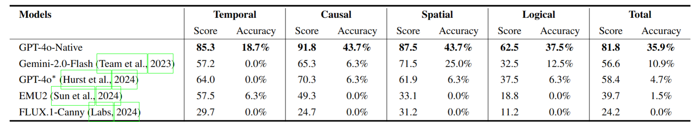
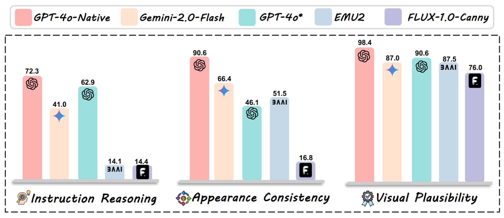
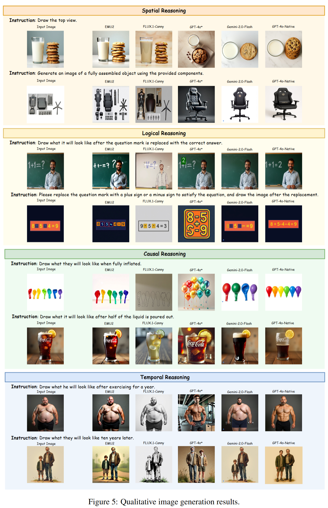

# Envisioning Beyond the Pixels: Benchmarking Reasoning-Informed Visual Editing

 [Xiangyu Zhao](https://scholar.google.com/citations?user=eqFr7IgAAAAJ&hl=zh-TW&oi=ao)\*, Peiyuan Zhang\*, Kexian Tang\*, [Hao Li](https://scholar.google.com/citations?user=qHqQsY4AAAAJ&hl=zh-TW&oi=sra), [Zicheng Zhang](https://zzc-1998.github.io/), [Guangtao Zhai](https://faculty.sjtu.edu.cn/zhaiguangtao/zh_CN/index.htm), [Junchi Yan](https://thinklab.sjtu.edu.cn/), Hua Yang,  [Xue Yang](https://yangxue.site/), [Haodong Duan](https://kennymckormick.github.io/)

  

    
  

 

  

## 🎉 News
- **\[2025/04\]** The benchmark and evaluation code will be released soon.

## 📖 Introduction

In this work, we introduce **RISEBench**, the first benchmark for evaluating **R**easoning-**I**nformed vi**S**ual **E**diting (RISE). RISEBench focuses on four key reasoning types: *Temporal, Causal, Spatial, and Logical Reasoning*.

To comprehensively assess model performance across diverse task types, we define three key evaluation dimensions: *Instruction Reasoning*, *Appearance Consistency*, and *Visual Plausibility*.

Besides, we design a robust **LMM-as-a-Judge** evaluation pipeline and leverage state-of-the-art LMMs(GPT-4o) to generate automated assessments. Our approach offers a scalable and reproducible alternative to human evaluation, while maintaining a high degree of alignment with human judgment.

**As an initial effort, RISEBench aims to provide foundational insights into reasoning-aware visual editing and to catalyze future research. Though still in its early stages, we are committed to continuously expanding and refining the benchmark to support more comprehensive, reliable, and scalable evaluations of next-generation multimodal systems.**

  

## 🔥 Benchmark Performance
To evaluate the performance of representative visual editing approaches, we selected a diverse set of models spanning multiple model architectures and generation paradigms. Specifically, Flux1.0-Canny serves as a representative diffusion-based editing model, while EMU2 exemplifies the auto-regressive generation paradigm. We also include three proprietary models: **GPT-4o(Previous)**, **Gemini 2.0-Flash**, and **GPT-4o-Native (2025-03-26)**. Since all of the proprietary models do not offer public APIs for programmatic evaluation, we obtained their outputs directly via their respective official online interfaces.

  

  

## 🔥 Outputs of Current Models
We exhibit all outputs in the appendix. For more details, please refer to our paper.

  

