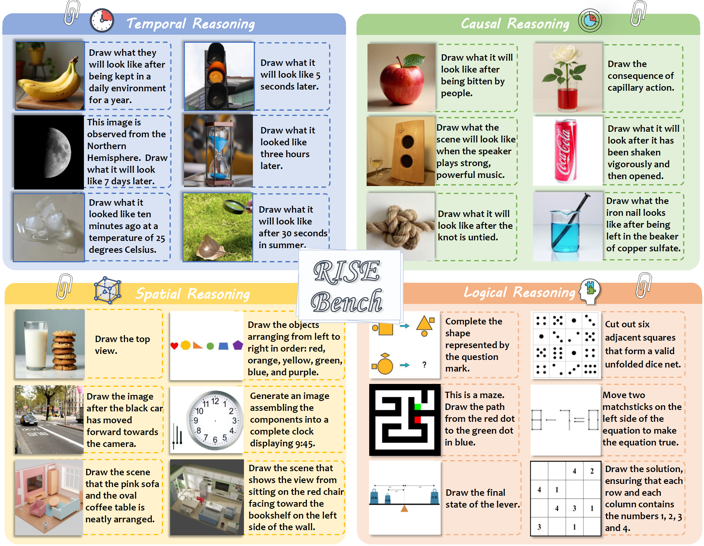
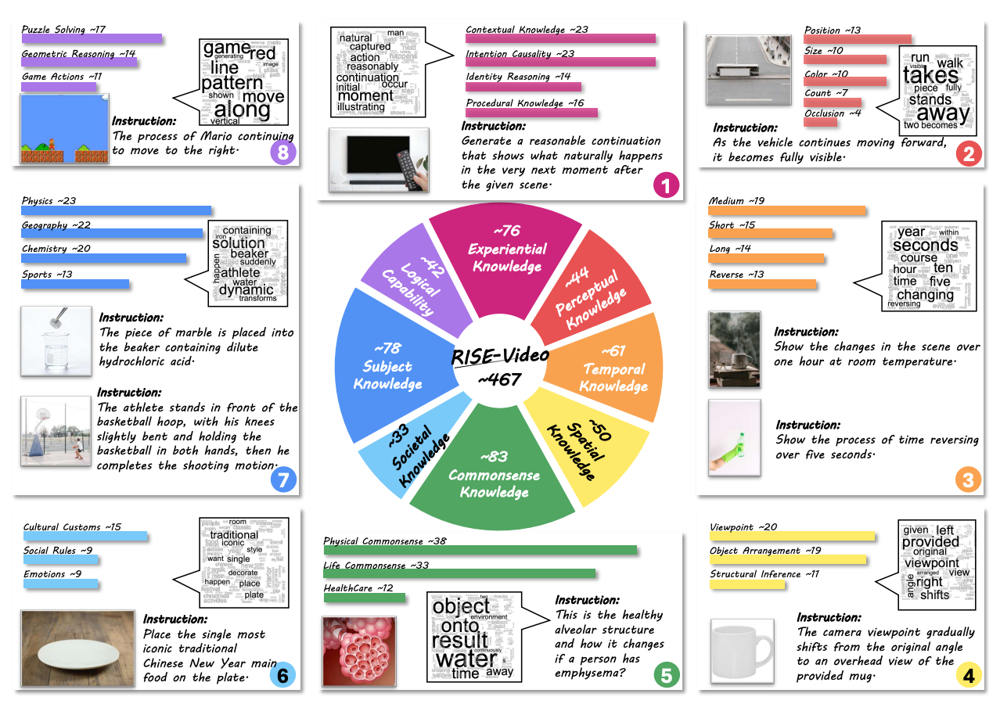

<div align="center">

# Reasoning-Informed Visual Editing

**RISEBench · RISEBench++ · RISE-Video**

[RISEBench](RISEBench/README.md) · [RISEBench++](RISEBench++/README.md) · [RISE-Video](https://github.com/VisionXLab/Rise-Video)

</div>

This repository brings together the **RISE series** of benchmarks for reasoning-informed visual editing and generation. It includes the original RISEBench implementation and introduces the extended RISEBench++, with links to our related video benchmark, RISE-Video.

## Table of Contents

- [Overview](#overview)
- [Updates](#updates)
- [Evaluation Results](#evaluation-results)
- [Quick Start](#quick-start)
- [Citation](#citation)

<a id="overview"></a>
## 📖 Overview

### (1) RISEBench

**Envisioning Beyond the Pixels: Benchmarking Reasoning-Informed Visual Editing**  
**NeurIPS 2025 Datasets and Benchmarks Track · Oral**

[Paper](https://arxiv.org/abs/2504.02826) · [Dataset](https://huggingface.co/datasets/PhoenixZ/RISEBench) · [Model Outputs](https://huggingface.co/datasets/zpy777/RISEBench_Outputs)

<div align="center">
  
</div>

RISEBench benchmarks reasoning-informed visual editing across **temporal, causal, spatial, and logical reasoning**. The full benchmark contains **360 test cases** and evaluates **Instruction Reasoning, Appearance Consistency, and Visual Plausibility** using an LMM-as-a-Judge pipeline. A **64-sample subset** is included for initial experiments.

> **Note:** The code, sample data, and images are in [`RISEBench/`](RISEBench). The detailed introduction, results, and usage instructions are in [RISEBench README](RISEBench/README.md). The full **360-case dataset** is available on [Hugging Face](https://huggingface.co/datasets/VisionXLab/RISEBench).

### (2) RISEBench++

**Reasoning-Informed Visual Editing**

<div align="center">
  
</div>

RISEBench++ expands the benchmark to **1,000 bilingual test cases** across **six reasoning dimensions, 12 subcategories, and 65 fine-grained task types**. In addition to temporal, causal, spatial, and logical reasoning, it introduces **counterfactual and hybrid reasoning**, with support for **single-image, multi-image, and multi-turn editing**. Its improved evaluation pipeline uses dimension-specific evidence and scoring rubrics to assess reasoning, appearance consistency, and visual plausibility. The accompanying study evaluates **58 approaches** spanning open-source models, closed-source models, and agentic methods.

We also release **RISE-Agent**. RISE-Agent is a training-free framework combining reasoning-driven planning, tool-augmented execution, and verifier-guided refinement.

> **Note:** RISEBench++ evaluation code, figures, and a **60-case sample subset** are in [`RISEBench++/`](RISEBench++). The introduction, results, and usage instructions for RISEBench++ and RISE-Agent are in [RISEBench++ README](RISEBench++/README.md). The full **1,000-case dataset** is available on [Hugging Face](https://huggingface.co/datasets/VisionXLab/RISEBench-plusplus).

### (3) RISE-Video

**RISE-Video: Can Video Generators Decode Implicit World Rules?**

[Paper](https://arxiv.org/abs/2602.05986) · [Dataset](https://huggingface.co/datasets/VisionXLab/RISE-Video) · [Code](https://github.com/VisionXLab/Rise-Video)

<div align="center">
  
</div>

RISE-Video evaluates reasoning in **Text-Image-to-Video synthesis**. It contains **467 human-annotated samples** across eight categories covering commonsense, subject, perceptual, societal, logical, experiential, spatial, and temporal knowledge or capabilities. Its evaluation measures **Reasoning Alignment, Temporal Consistency, Physical Rationality, and Visual Quality**, supported by an automated LMM-based assessment pipeline.

> **Note:** RISE-Video is maintained in its [own repository](https://github.com/VisionXLab/Rise-Video), which contains the data preparation and evaluation instructions.

<a id="updates"></a>
## 🎉 Updates

- **\[2026/10/09\]** We release **RISEBench++** and **RISE-Agent** together! The full **1,000-case dataset** is available on [Hugging Face](https://huggingface.co/datasets/VisionXLab/RISEBench-plusplus). See the [documentation](RISEBench++/README.md) to get started.
- **\[2026/04/23\]** We discovered a minor issue in our previous evaluation script, which has now been fixed. All model results have been updated accordingly, including the latest results for **GPT-Image-2**.
- **\[2026/04/08\]** We’re excited to see [Luma](https://lumalabs.ai/uni-1/tech-specs) evaluate their model **Uni-1** on our benchmark and achieve strong results, congratulations!
- **\[2026/02/06\]** The video version of our work, **RISE-Video**, has been released —— Check it out [here]( https://github.com/VisionXLab/Rise-Video)!
- **\[2025/12/31\]** We have updated the results of **Qwen-Image-Edit-2511**.
- **\[2025/12/17\]** We have updated the results of **GPT-Image-1.5**. It is the first model to reach **50.0%** accuracy, setting a new SoTA, and we’re excited to see continuous progress as models push each other forward in this fast-moving competition. 🚀
- **\[2025/11/22\]** We have updated the results of **Gemini-3-pro-image-preview**. It has achieved an impressive 47.2% SoTA accuracy! Absolutely incredible progress!
- **\[2025/10/20\]** We have open-sourced the output images of models. [Visit the outputs →](https://huggingface.co/datasets/zpy777/RISEBench_Outputs)
- **\[2025/10/10\]** We have updated the results of **GPT-Image-1-mini**.
- **\[2025/09/19\]** Our paper is accepted by NeurIPS Datasets and Benchmarks Track 2025 (**Oral, 7/1995**)! 
- **\[2025/09/10\]** We have updated the results of **Seedream-4.0**.
- **\[2025/08/29\]** We have updated the results of **Gemini-2.5-Flash-Image**. The model now takes the top spot, surpassing GPT-Image-1.
- **\[2025/08/20\]** We have updated the results of **Qwen-Image-Edit**.
- **\[2025/08/07\]** We have updated the results of **FLUX.1-Kontext-dev**, thanks to @[ErfeiCui](https://github.com/ErfeiCui). 
- **\[2025/07/08\]** We’ve launched a *HuggingFace Space* that hosts every image generated during our model evaluations. Dive into the gallery and explore the visual diversity of RISEBench, just click and enjoy! [Visit the gallery →](https://huggingface.co/spaces/opencompass/RISEBench_Gallery)
- **\[2025/06/15\]** **RISEBench has been officially evaluated by BAGEL**, achieving third-highest overall performance(Thinking Mode) with results comparable to Gemini-2.0. Check [OfficialRepo](https://github.com/bytedance-seed/BAGEL) for details about evaluation. 
- **\[2025/05/27\]** We have released two versions of our benchmark suite: the full version, named **RISEBench-360**, and a smaller version, named **RISEBench-64**. The RISEBench-64 version is also available in our [repository](RISEBench/data) as an initial offering. Feel free to choose the version that best suits your needs! :smiley:
- **\[2025/05/27\]** Our paper has been updated! Please refer to [Arxiv](https://arxiv.org/pdf/2504.02826) for comprehensive details.
- **\[2025/05/19\]** **RISEBench Final Version(Scaled Up to 360 Samples) has been released!** Please refer to [HF-RISEBench](https://huggingface.co/datasets/PhoenixZ/RISEBench) for full data of RISEBench.
- **\[2025/04/08\]** RISEBench is Scaling Up! The final complete benchmark will be released soon. Stay tuned for updates!
- **\[2025/04/08\]** The benchmark and evaluation code have been released! Have fun :smiley: .
- **\[2025/04/05\]** Our paper is released.
- **\[2025/04/05\]** The benchmark and evaluation code will be released soon.

<a id="evaluation-results"></a>
## 🔥 Evaluation Results

| Benchmark | Results |
| --- | --- |
| RISEBench | [Official leaderboard](RISEBench/README.md#leaderboard) |
| RISEBench++ | [Official leaderboard](RISEBench++/README.md#leaderboard) |
| RISE-Video | [Official leaderboard](https://github.com/VisionXLab/Rise-Video#-scoreboard) |

> **Data:** The bundled RISEBench and RISEBench++ data are demo subsets; please download the full datasets from Hugging Face for full-benchmark evaluation.

<a id="quick-start"></a>
## 🛠️ Quick Start

- **RISEBench:** Follow the [original benchmark instructions](RISEBench/README.md#quick-start). Code and the 64-sample subset are included in `RISEBench/`.
- **RISEBench++:** Start with the [60-case sample subset](RISEBench++/data/overall_data.json) and follow the [evaluation instructions](RISEBench++/README.md#quick-start).
- **RISE-Video:** Follow the [video generation and evaluation instructions](https://github.com/VisionXLab/Rise-Video#-get-started).

```text
.
├── README.md
├── assets/
├── RISEBench/
│   ├── README.md
│   ├── data/
│   ├── images/
│   ├── outputs/
│   ├── gpt_eval.py
│   └── utils.py
└── RISEBench++/
    ├── README.md
    ├── data/
    ├── images/
    ├── outputs/
    ├── rise-agent/
    ├── gemini_eval.py
    └── utils.py
```

<a id="citation"></a>
## Citation

If you find the RISE series useful, please cite the corresponding work.

### RISEBench

```bibtex
@article{zhao2025envisioning,
  title={Envisioning beyond the pixels: Benchmarking reasoning-informed visual editing},
  author={Zhao, Xiangyu and Zhang, Peiyuan and Tang, Kexian and Li, Hao and Zhang, Zicheng and Zhai, Guangtao and Yan, Junchi and Yang, Hua and Yang, Xue and Duan, Haodong},
  journal={Advances in neural information processing systems},
  year={2025}
}
```

### RISEBench++

The BibTeX entry for **Reasoning-Informed Visual Editing** will be added with the public manuscript release.

### RISE-Video

```bibtex
@article{liu2026rise,
  title={RISE-Video: Can Video Generators Decode Implicit World Rules?},
  author={Liu, Mingxin and Ma, Shuran and Meng, Shibei and Zhao, Xiangyu and Zhang, Zicheng and Zhang, Shaofeng and Zhong, Zhihang and Chen, Peixian and Cao, Haoyu and Sun, Xing and others},
  journal={arXiv preprint arXiv:2602.05986},
  year={2026}
}
```
