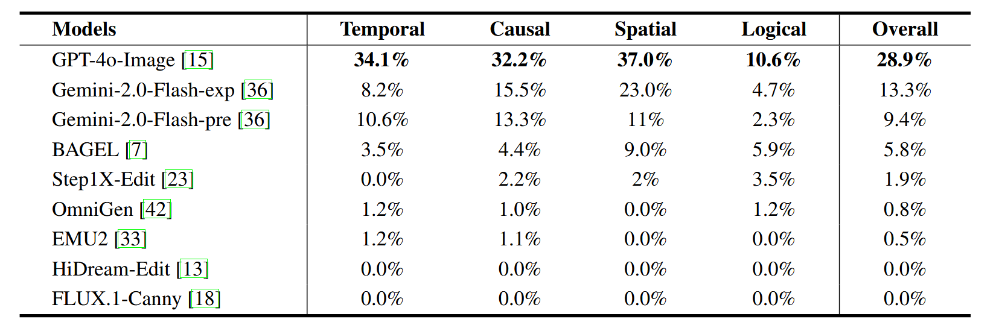

<div align="center">

# Envisioning Beyond the Pixels: Benchmarking Reasoning-Informed Visual Editing

[Xiangyu Zhao](https://scholar.google.com/citations?user=eqFr7IgAAAAJ&hl=zh-TW&oi=ao)\*,
[Peiyuan Zhang](https://scholar.google.com.hk/citations?user=rQbW67AAAAAJ&hl=zh-CN)\*,
[Kexian Tang](https://scholar.google.com/citations?user=cXjomd8AAAAJ&hl=zh-CN&oi=ao)\*,
Xiaorong Zhu\*,

[Hao Li](https://scholar.google.com/citations?user=qHqQsY4AAAAJ&hl=zh-TW&oi=sra),
[Wenhao Chai](https://wenhaochai.com/),
[Zicheng Zhang](https://zzc-1998.github.io/),
[Renqiu Xia](https://scholar.google.com/citations?user=E520fqQAAAAJ&hl=zh-CN),

[Guangtao Zhai](https://faculty.sjtu.edu.cn/zhaiguangtao/zh_CN/index.htm),
[Junchi Yan](https://thinklab.sjtu.edu.cn/),
[Hua Yang](https://ee.sjtu.edu.cn/FacultyDetail.aspx?id=29&infoid=66&flag=66),
[Xue Yang](https://yangxue.site/),
[Haodong Duan](https://kennymckormick.github.io/)

<p align="center">
  <a href='https://arxiv.org/abs/2504.02826'>
    
  </a>
  <a href='https://huggingface.co/datasets/PhoenixZ/RISEBench'>
    
  </a>

If you find our work helpful, please consider giving us a ⭐ or citation :blush:

</p>
</div>
<div align="center">
  
</div>

## 🎉 News
- **\[2025/05/19\]** We will update our arxiv paper soon.
- **\[2025/05/19\]** **RISEBench Final Version(Scaled Up to 360 Samples) has been released!** Please refer to [huggingface](https://huggingface.co/datasets/PhoenixZ/RISEBench) for full data of RISEBench.
- **\[2025/04/08\]** RISEBench is Scaling Up! The final complete benchmark will be released soon. Stay tuned for updates!
- **\[2025/04/08\]** The benchmark and evaluation code have been released! Have fun :smiley: .
- **\[2025/04/05\]** Our paper is released.
- **\[2025/04/05\]** The benchmark and evaluation code will be released soon.

## 📖 Introduction

<div align="center">
  
</div>

In this work, we introduce **RISEBench**, the first benchmark for evaluating **R**easoning-**I**nformed vi**S**ual **E**diting (RISE). RISEBench focuses on four key reasoning types: *Temporal, Causal, Spatial*, and *Logical Reasoning*.

To comprehensively assess model performance across diverse task types, we define three key evaluation dimensions: *Instruction Reasoning*, *Appearance Consistency*, and *Visual Plausibility*.

Besides, we design a robust **LMM-as-a-Judge** evaluation pipeline and leverage state-of-the-art LMMs(GPT-4o) to generate automated assessments. Our approach offers a scalable and reproducible alternative to human evaluation, while maintaining a high degree of alignment with human judgment.

**As an initial effort, RISEBench aims to provide foundational insights into reasoning-aware visual editing and to catalyze future research. Though still in its early stages, we are committed to continuously expanding and refining the benchmark to support more comprehensive, reliable, and scalable evaluations of next-generation multimodal systems.**

<div align="center">
  
</div>

## 🔥 Benchmark Performance
To evaluate the performance of representative visual editing approaches, we selected a diverse set of models spanning multiple model architectures and generation paradigms. Specifically, Flux1.0-Canny serves as a representative diffusion-based editing model, while EMU2 exemplifies the auto-regressive generation paradigm. We also include three proprietary models: **GPT-4o(Previous)**, **Gemini 2.0-Flash**, and **GPT-4o-Native (2025-03-26)**. Since all of the proprietary models do not offer public APIs for programmatic evaluation, we obtained their outputs directly via their respective official online interfaces.

<div align="center">
  
</div>


<div align="center">
  
</div>


## 🛠️ Quick Start

### 1. Output Generation
Our benchmark dataset is stored in [`data_total.json`](data/data_total.json). The input images for the four categories are located in the [`data`](data) directory. Each sample in the dataset contains an `instruction` and an associated `image`. You can use these inputs to generate the corresponding output image.

**Output File Structure:**
Generated outputs should be saved in the following directory structure:

**`outputs/{MODEL_NAME}/images/{CATEGORY}/{INDEX_NAME}.{FORMAT}`**

- `{MODEL_NAME}`: The name of the model you are using (e.g., `gpt-4o`).
- `{CATEGORY}`: The category of the sample (e.g., `temporal_reasoning`).
- `{INDEX_NAME}`: The index of the sample in the dataset.
- `{FORMAT}`: The file format of the output image (supported formats: `.png`, `.jpg`, or `.jpeg`).

For example:
`outputs/gpt-4o-native/images/temporal_reasoning/temporal_reasoning_1.png`


### 2. Evaluation By GPT-4o
Once all outputs are generated and saved in the specified format, you can evaluate them using the `gpt_eval.py` script.

#### Step 1: Configure API Settings
Open the `gpt_eval.py` file and update the following parameters with your OpenAI credentials:
- `api_key`: Your OpenAI API key.
- `api_base`: Your OpenAI API base URL (if applicable).

#### Step 2: Run the Evaluation Script
Execute the script using the following command:
```bash
python gpt_eval.py --input data/data_total.json --output outputs/MODEL_NAME
```

#### Step 3: Review the Results
After running the script, three result files will be generated in the `outputs/{MODEL_NAME}` directory:

1. **`{MODEL_NAME}_judge.csv`**: A CSV file containing the total evaluation scores.
2. **`{MODEL_NAME}_judge.xlsx`**: An Excel file storing detailed responses from the GPT-4o judge model.
3. **`{MODEL_NAME}.pkl`**: A serialized pickle file saving the raw responses from the judge model, which can be used to resume or extend evaluations later.

## 🔥 Outputs of Current Models
We exhibit some outputs of the five models in the appendix. For more details, please refer to our paper.

<div align="center">
  
</div>

## Citation
If you find RISEBench useful, please cite using this BibTeX:
```bibtex
@article{zhao2025envisioning,
  title={Envisioning Beyond the Pixels: Benchmarking Reasoning-Informed Visual Editing},
  author={Zhao, Xiangyu and Zhang, Peiyuan and Tang, Kexian and Li, Hao and Zhang, Zicheng and Zhai, Guangtao and Yan, Junchi and Yang, Hua and Yang, Xue and Duan, Haodong},
  journal={arXiv preprint arXiv:2504.02826},
  year={2025}
}
```