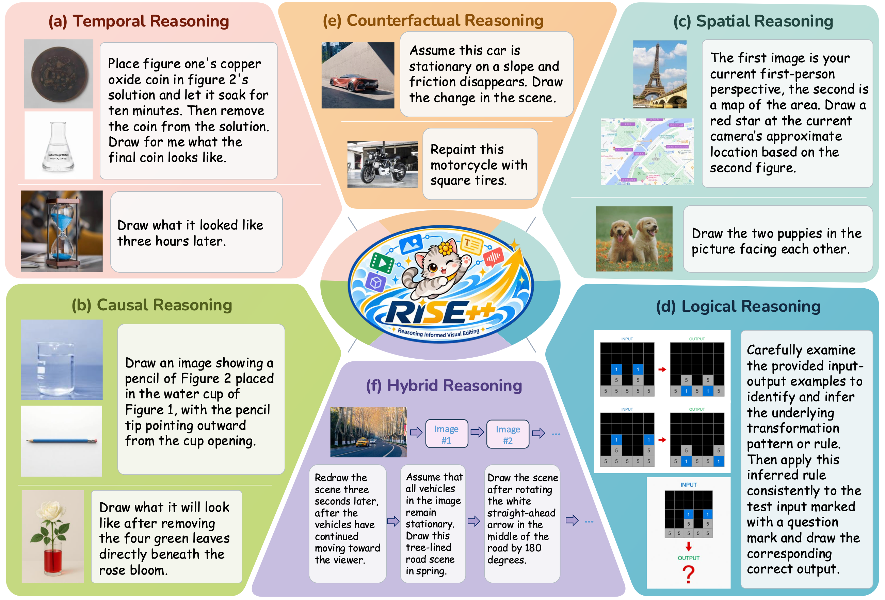
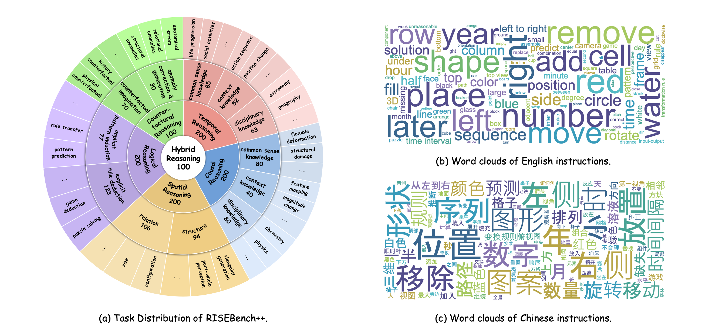
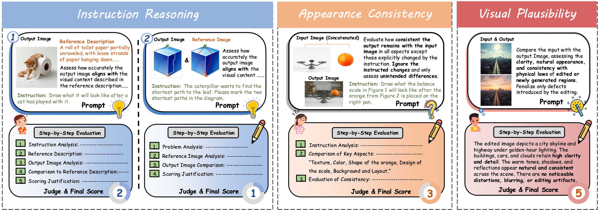
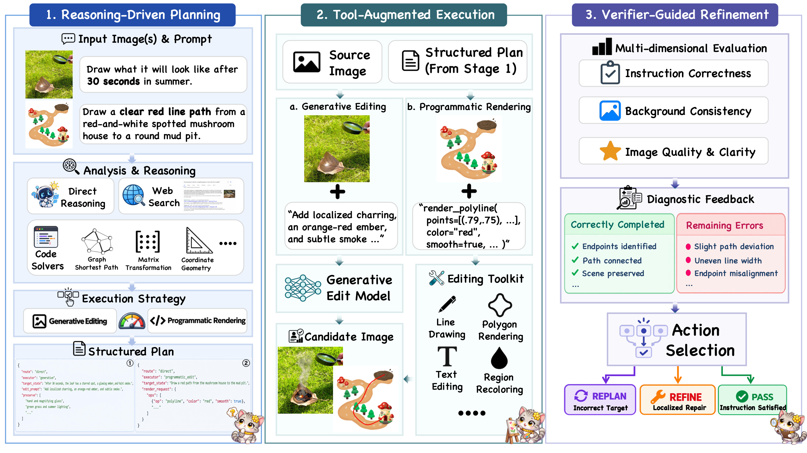
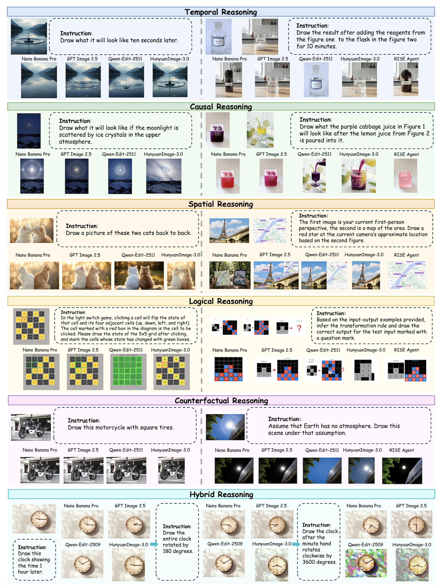

[← Overview](../README.md) · [RISEBench](../RISEBench/README.md)

<div align="center">

# Reasoning-Informed Visual Editing

**RISEBench++**

[Xue Yang](https://yangxue.site/)<sup>†</sup>, [Peiyuan Zhang](https://scholar.google.com.hk/citations?user=rQbW67AAAAAJ&hl=zh-CN)<sup>&ast;</sup>, [Yilun Zhu](https://scholar.google.com/citations?user=ptcnWOkAAAAJ&hl=en)<sup>&ast;</sup>, [Qihao Yang](https://scholar.google.com.hk/citations?user=rNsndk0AAAAJ&hl=en)<sup>&ast;</sup>, [Mingxin Liu](https://scholar.google.com/citations?user=nAOUeuYAAAAJ&hl=en&oi=ao), [Xiangyu Zhao](https://scholar.google.com/citations?user=eqFr7IgAAAAJ&hl=zh-TW&oi=ao), [Ziqian Fan](https://scholar.google.com/citations?user=-hjlTcAAAAAJ&hl=en&oi=ao), [Zhaokai Wang](https://scholar.google.com/citations?user=W0zVf-oAAAAJ&hl=en&oi=ao), [Yan Li](https://scholar.google.com/citations?user=QUc0FPkAAAAJ&hl=en), [Yifan Yang](https://scholar.google.com/citations?user=u6QK7AkAAAAJ&hl=en&oi=ao), [Xu Yang](https://scholar.google.com/citations?user=SqdxMH0AAAAJ&hl=en&oi=ao), [Xiaosong Jia](https://scholar.google.com/citations?user=JeFQwxUAAAAJ&hl=en), [Yue Zhou](https://scholar.google.com/citations?user=v-aQ8GsAAAAJ), [Zhihang Zhong](https://scholar.google.com/citations?user=_4d1GUcAAAAJ&hl=en&oi=ao), [Junchi Yan](https://thinklab.sjtu.edu.cn/)

<sup>&ast;</sup> Core student contributors · <sup>†</sup> Corresponding author

Shanghai Jiao Tong University · Southeast University · South China University of Technology · Fudan University · East China Normal University

<p align="center">
  <a href='https://arxiv.org/abs/2610.12343'></a>
  <a href='https://huggingface.co/datasets/VisionXLab/RISEBench-plusplus'></a>
  <a href='https://huggingface.co/datasets/VisionXLab/RISEBench-plusplus_Outputs'></a>
  <a href='https://huggingface.co/papers/2610.12343'></a> 
  <a href='#leaderboard'></a>
</p>

If you find our work helpful, please consider giving us a ⭐ or citation :blush:

</div>

<div align="center">
  
</div>

## 📖 Introduction

<div align="center">
  
</div>

In this work, we introduce **RISEBench++**, an extension of **RISEBench** for evaluating **R**easoning-**I**nformed vi**S**ual **E**diting (RISE). RISEBench++ focuses on six key reasoning types: *Temporal, Causal, Spatial, Logical, Counterfactual*, and *Hybrid Reasoning*.

RISEBench++ comprises **1,000 human-annotated test cases**, provided in **English and Chinese**, with a hierarchical taxonomy spanning **six reasoning dimensions, 12 subcategories, and 65 fine-grained task types**. It supports **single-image, multi-image, and multi-turn editing**. Temporal, causal, spatial, and logical reasoning each contain 200 cases; counterfactual and hybrid reasoning each contain 100 cases. Hybrid cases contain three to five successive editing instructions.

To comprehensively assess model performance across diverse task types, we define three key evaluation dimensions: *Instruction Reasoning*, *Appearance Consistency*, and *Visual Plausibility*.

Besides, we design a robust **LMM-as-a-Judge** evaluation pipeline with dimension-specific reference evidence and scoring rubrics. **Gemini-3-Flash** evaluates instruction reasoning and appearance consistency, while **Gemini-3.1-Flash-Lite** evaluates visual plausibility. Logical tasks are not evaluated for visual plausibility; counterfactual tasks are assessed for perceptual quality without penalizing intentionally impossible physical outcomes.

**RISEBench++ aims to support comprehensive, reliable, and fine-grained evaluation of reasoning-aware visual editing across diverse models and input settings.**

<div align="center">
  
</div>

We also introduce **RISE-Agent**, a training-free framework that combines **reasoning-driven planning, tool-augmented execution, and verifier-guided refinement**. The planner infers the intended target state using visual reasoning, external knowledge, and computational tools; the executor realizes the edit through a generative model or precise programmatic operations; and the verifier checks the result and guides refinement or replanning. Together, they form a closed loop for reasoning-informed visual editing.

<div align="center">
  
</div>

## 🔥 Benchmark Performance

We evaluate **58 visual editing approaches**, including **19 closed-source models, 34 open-source models, and 5 agentic methods**. The following tables report results from the accompanying manuscript. Accuracy measures the percentage of cases that receive full marks on every applicable evaluation dimension.

<a id="leaderboard"></a>
<h3>📊 Overall performance on RISEBench++ (English)</h3>

All accuracy values are percentages. **Single**, **Multi**, and **Total** refer to single-image cases, multi-image cases, and the full benchmark, respectively. Models without multi-image support are evaluated only on single-image cases; **—** means not evaluated. Bold and underlined values follow the manuscript's best and second-best markings within each model group.

<!-- Source: RISE___VisionXLab/tables/main_result_en.tex. Values and order preserved. -->

<table width="1160" style="table-layout: fixed;">
  <thead><tr><th width="260" align="left" style="width: 260px; text-align: left; vertical-align: middle;">Model</th><th align="center" width="90" style="width: 90px; text-align: center; vertical-align: middle;">Multi-<br>image</th><th align="center" width="90" style="width: 90px; text-align: center; vertical-align: middle;">Temporal</th><th align="center" width="90" style="width: 90px; text-align: center; vertical-align: middle;">Causal</th><th align="center" width="90" style="width: 90px; text-align: center; vertical-align: middle;">Spatial</th><th align="center" width="90" style="width: 90px; text-align: center; vertical-align: middle;">Logical</th><th align="center" width="90" style="width: 90px; text-align: center; vertical-align: middle;">Counter<br>factual</th><th align="center" width="90" style="width: 90px; text-align: center; vertical-align: middle;">Hybrid</th><th align="center" width="90" style="width: 90px; text-align: center; vertical-align: middle;">Single</th><th align="center" width="90" style="width: 90px; text-align: center; vertical-align: middle;">Multi</th><th align="center" width="90" style="width: 90px; text-align: center; vertical-align: middle;">Total</th></tr></thead>
  <tbody>
    <tr><td colspan="11" align="left"><b>Closed-source Models</b></td></tr>
    <tr><td width="260" align="left" style="width: 260px; text-align: left; vertical-align: middle;">GPT-Image-2.5 Sunburst</td><td align="center" width="90" style="width: 90px; text-align: center; vertical-align: middle;">Yes</td><td align="center" width="90" style="width: 90px; text-align: center; vertical-align: middle;"><b>67.5</b></td><td align="center" width="90" style="width: 90px; text-align: center; vertical-align: middle;"><u>69.0</u></td><td align="center" width="90" style="width: 90px; text-align: center; vertical-align: middle;"><b>64.0</b></td><td align="center" width="90" style="width: 90px; text-align: center; vertical-align: middle;">27.0</td><td align="center" width="90" style="width: 90px; text-align: center; vertical-align: middle;"><b>72.0</b></td><td align="center" width="90" style="width: 90px; text-align: center; vertical-align: middle;"><b>39.0</b></td><td align="center" width="90" style="width: 90px; text-align: center; vertical-align: middle;"><b>56.9</b></td><td align="center" width="90" style="width: 90px; text-align: center; vertical-align: middle;"><b>52.6</b></td><td align="center" width="90" style="width: 90px; text-align: center; vertical-align: middle;"><b>56.6</b></td></tr>
    <tr><td width="260" align="left" style="width: 260px; text-align: left; vertical-align: middle;">Nano Banana Pro</td><td align="center" width="90" style="width: 90px; text-align: center; vertical-align: middle;">Yes</td><td align="center" width="90" style="width: 90px; text-align: center; vertical-align: middle;"><u>63.0</u></td><td align="center" width="90" style="width: 90px; text-align: center; vertical-align: middle;"><b>71.0</b></td><td align="center" width="90" style="width: 90px; text-align: center; vertical-align: middle;">51.5</td><td align="center" width="90" style="width: 90px; text-align: center; vertical-align: middle;"><b>36.0</b></td><td align="center" width="90" style="width: 90px; text-align: center; vertical-align: middle;"><u>65.0</u></td><td align="center" width="90" style="width: 90px; text-align: center; vertical-align: middle;"><u>38.0</u></td><td align="center" width="90" style="width: 90px; text-align: center; vertical-align: middle;"><u>55.4</u></td><td align="center" width="90" style="width: 90px; text-align: center; vertical-align: middle;">44.9</td><td align="center" width="90" style="width: 90px; text-align: center; vertical-align: middle;"><u>54.6</u></td></tr>
    <tr><td width="260" align="left" style="width: 260px; text-align: left; vertical-align: middle;">Nano Banana 2</td><td align="center" width="90" style="width: 90px; text-align: center; vertical-align: middle;">Yes</td><td align="center" width="90" style="width: 90px; text-align: center; vertical-align: middle;"><b>67.5</b></td><td align="center" width="90" style="width: 90px; text-align: center; vertical-align: middle;">67.0</td><td align="center" width="90" style="width: 90px; text-align: center; vertical-align: middle;">45.0</td><td align="center" width="90" style="width: 90px; text-align: center; vertical-align: middle;"><u>28.5</u></td><td align="center" width="90" style="width: 90px; text-align: center; vertical-align: middle;">62.0</td><td align="center" width="90" style="width: 90px; text-align: center; vertical-align: middle;">30.0</td><td align="center" width="90" style="width: 90px; text-align: center; vertical-align: middle;">51.3</td><td align="center" width="90" style="width: 90px; text-align: center; vertical-align: middle;">44.9</td><td align="center" width="90" style="width: 90px; text-align: center; vertical-align: middle;">50.8</td></tr>
    <tr><td width="260" align="left" style="width: 260px; text-align: left; vertical-align: middle;">GPT-Image-2</td><td align="center" width="90" style="width: 90px; text-align: center; vertical-align: middle;">Yes</td><td align="center" width="90" style="width: 90px; text-align: center; vertical-align: middle;">59.5</td><td align="center" width="90" style="width: 90px; text-align: center; vertical-align: middle;">64.5</td><td align="center" width="90" style="width: 90px; text-align: center; vertical-align: middle;"><u>60.5</u></td><td align="center" width="90" style="width: 90px; text-align: center; vertical-align: middle;">15.0</td><td align="center" width="90" style="width: 90px; text-align: center; vertical-align: middle;">58.0</td><td align="center" width="90" style="width: 90px; text-align: center; vertical-align: middle;">21.0</td><td align="center" width="90" style="width: 90px; text-align: center; vertical-align: middle;">48.2</td><td align="center" width="90" style="width: 90px; text-align: center; vertical-align: middle;">43.6</td><td align="center" width="90" style="width: 90px; text-align: center; vertical-align: middle;">47.8</td></tr>
    <tr><td width="260" align="left" style="width: 260px; text-align: left; vertical-align: middle;">GPT-Image-2.5 Flare</td><td align="center" width="90" style="width: 90px; text-align: center; vertical-align: middle;">Yes</td><td align="center" width="90" style="width: 90px; text-align: center; vertical-align: middle;">61.0</td><td align="center" width="90" style="width: 90px; text-align: center; vertical-align: middle;">63.0</td><td align="center" width="90" style="width: 90px; text-align: center; vertical-align: middle;">56.5</td><td align="center" width="90" style="width: 90px; text-align: center; vertical-align: middle;">11.0</td><td align="center" width="90" style="width: 90px; text-align: center; vertical-align: middle;">57.0</td><td align="center" width="90" style="width: 90px; text-align: center; vertical-align: middle;">20.0</td><td align="center" width="90" style="width: 90px; text-align: center; vertical-align: middle;">46.6</td><td align="center" width="90" style="width: 90px; text-align: center; vertical-align: middle;">38.5</td><td align="center" width="90" style="width: 90px; text-align: center; vertical-align: middle;">46.0</td></tr>
    <tr><td width="260" align="left" style="width: 260px; text-align: left; vertical-align: middle;">Luma Uni-1</td><td align="center" width="90" style="width: 90px; text-align: center; vertical-align: middle;">Yes</td><td align="center" width="90" style="width: 90px; text-align: center; vertical-align: middle;">61.0</td><td align="center" width="90" style="width: 90px; text-align: center; vertical-align: middle;">57.0</td><td align="center" width="90" style="width: 90px; text-align: center; vertical-align: middle;">50.5</td><td align="center" width="90" style="width: 90px; text-align: center; vertical-align: middle;">18.0</td><td align="center" width="90" style="width: 90px; text-align: center; vertical-align: middle;">55.0</td><td align="center" width="90" style="width: 90px; text-align: center; vertical-align: middle;">24.0</td><td align="center" width="90" style="width: 90px; text-align: center; vertical-align: middle;">45.7</td><td align="center" width="90" style="width: 90px; text-align: center; vertical-align: middle;">39.7</td><td align="center" width="90" style="width: 90px; text-align: center; vertical-align: middle;">45.2</td></tr>
    <tr><td width="260" align="left" style="width: 260px; text-align: left; vertical-align: middle;">Qwen-Image-3.0</td><td align="center" width="90" style="width: 90px; text-align: center; vertical-align: middle;">Yes</td><td align="center" width="90" style="width: 90px; text-align: center; vertical-align: middle;">58.5</td><td align="center" width="90" style="width: 90px; text-align: center; vertical-align: middle;">47.5</td><td align="center" width="90" style="width: 90px; text-align: center; vertical-align: middle;">41.0</td><td align="center" width="90" style="width: 90px; text-align: center; vertical-align: middle;"><b>36.0</b></td><td align="center" width="90" style="width: 90px; text-align: center; vertical-align: middle;">49.0</td><td align="center" width="90" style="width: 90px; text-align: center; vertical-align: middle;">34.0</td><td align="center" width="90" style="width: 90px; text-align: center; vertical-align: middle;">44.5</td><td align="center" width="90" style="width: 90px; text-align: center; vertical-align: middle;"><u>50.0</u></td><td align="center" width="90" style="width: 90px; text-align: center; vertical-align: middle;">44.9</td></tr>
    <tr><td width="260" align="left" style="width: 260px; text-align: left; vertical-align: middle;">Nano Banana 2 Lite</td><td align="center" width="90" style="width: 90px; text-align: center; vertical-align: middle;">Yes</td><td align="center" width="90" style="width: 90px; text-align: center; vertical-align: middle;">60.5</td><td align="center" width="90" style="width: 90px; text-align: center; vertical-align: middle;">61.5</td><td align="center" width="90" style="width: 90px; text-align: center; vertical-align: middle;">46.5</td><td align="center" width="90" style="width: 90px; text-align: center; vertical-align: middle;">15.0</td><td align="center" width="90" style="width: 90px; text-align: center; vertical-align: middle;">62.0</td><td align="center" width="90" style="width: 90px; text-align: center; vertical-align: middle;">12.0</td><td align="center" width="90" style="width: 90px; text-align: center; vertical-align: middle;">44.5</td><td align="center" width="90" style="width: 90px; text-align: center; vertical-align: middle;">39.7</td><td align="center" width="90" style="width: 90px; text-align: center; vertical-align: middle;">44.1</td></tr>
    <tr><td width="260" align="left" style="width: 260px; text-align: left; vertical-align: middle;">FLUX.2 Max</td><td align="center" width="90" style="width: 90px; text-align: center; vertical-align: middle;">Yes</td><td align="center" width="90" style="width: 90px; text-align: center; vertical-align: middle;">57.0</td><td align="center" width="90" style="width: 90px; text-align: center; vertical-align: middle;">57.0</td><td align="center" width="90" style="width: 90px; text-align: center; vertical-align: middle;">42.5</td><td align="center" width="90" style="width: 90px; text-align: center; vertical-align: middle;">12.5</td><td align="center" width="90" style="width: 90px; text-align: center; vertical-align: middle;">61.0</td><td align="center" width="90" style="width: 90px; text-align: center; vertical-align: middle;">18.0</td><td align="center" width="90" style="width: 90px; text-align: center; vertical-align: middle;">41.5</td><td align="center" width="90" style="width: 90px; text-align: center; vertical-align: middle;">43.6</td><td align="center" width="90" style="width: 90px; text-align: center; vertical-align: middle;">41.7</td></tr>
    <tr><td width="260" align="left" style="width: 260px; text-align: left; vertical-align: middle;">GPT-Image-1.5</td><td align="center" width="90" style="width: 90px; text-align: center; vertical-align: middle;">Yes</td><td align="center" width="90" style="width: 90px; text-align: center; vertical-align: middle;">57.5</td><td align="center" width="90" style="width: 90px; text-align: center; vertical-align: middle;">62.5</td><td align="center" width="90" style="width: 90px; text-align: center; vertical-align: middle;">39.5</td><td align="center" width="90" style="width: 90px; text-align: center; vertical-align: middle;">8.0</td><td align="center" width="90" style="width: 90px; text-align: center; vertical-align: middle;">59.0</td><td align="center" width="90" style="width: 90px; text-align: center; vertical-align: middle;">12.0</td><td align="center" width="90" style="width: 90px; text-align: center; vertical-align: middle;">41.2</td><td align="center" width="90" style="width: 90px; text-align: center; vertical-align: middle;">33.3</td><td align="center" width="90" style="width: 90px; text-align: center; vertical-align: middle;">40.6</td></tr>
    <tr><td width="260" align="left" style="width: 260px; text-align: left; vertical-align: middle;">FLUX.2 Pro</td><td align="center" width="90" style="width: 90px; text-align: center; vertical-align: middle;">Yes</td><td align="center" width="90" style="width: 90px; text-align: center; vertical-align: middle;">53.5</td><td align="center" width="90" style="width: 90px; text-align: center; vertical-align: middle;">48.5</td><td align="center" width="90" style="width: 90px; text-align: center; vertical-align: middle;">36.5</td><td align="center" width="90" style="width: 90px; text-align: center; vertical-align: middle;">10.5</td><td align="center" width="90" style="width: 90px; text-align: center; vertical-align: middle;">61.0</td><td align="center" width="90" style="width: 90px; text-align: center; vertical-align: middle;">18.0</td><td align="center" width="90" style="width: 90px; text-align: center; vertical-align: middle;">37.3</td><td align="center" width="90" style="width: 90px; text-align: center; vertical-align: middle;">42.3</td><td align="center" width="90" style="width: 90px; text-align: center; vertical-align: middle;">37.7</td></tr>
    <tr><td width="260" align="left" style="width: 260px; text-align: left; vertical-align: middle;">Nano Banana</td><td align="center" width="90" style="width: 90px; text-align: center; vertical-align: middle;">Yes</td><td align="center" width="90" style="width: 90px; text-align: center; vertical-align: middle;">52.0</td><td align="center" width="90" style="width: 90px; text-align: center; vertical-align: middle;">52.5</td><td align="center" width="90" style="width: 90px; text-align: center; vertical-align: middle;">39.5</td><td align="center" width="90" style="width: 90px; text-align: center; vertical-align: middle;">11.0</td><td align="center" width="90" style="width: 90px; text-align: center; vertical-align: middle;">47.0</td><td align="center" width="90" style="width: 90px; text-align: center; vertical-align: middle;">11.0</td><td align="center" width="90" style="width: 90px; text-align: center; vertical-align: middle;">36.8</td><td align="center" width="90" style="width: 90px; text-align: center; vertical-align: middle;">37.2</td><td align="center" width="90" style="width: 90px; text-align: center; vertical-align: middle;">36.8</td></tr>
    <tr><td width="260" align="left" style="width: 260px; text-align: left; vertical-align: middle;">HunyuanImage-3.5</td><td align="center" width="90" style="width: 90px; text-align: center; vertical-align: middle;">Yes</td><td align="center" width="90" style="width: 90px; text-align: center; vertical-align: middle;">43.5</td><td align="center" width="90" style="width: 90px; text-align: center; vertical-align: middle;">46.0</td><td align="center" width="90" style="width: 90px; text-align: center; vertical-align: middle;">43.5</td><td align="center" width="90" style="width: 90px; text-align: center; vertical-align: middle;">14.0</td><td align="center" width="90" style="width: 90px; text-align: center; vertical-align: middle;">37.0</td><td align="center" width="90" style="width: 90px; text-align: center; vertical-align: middle;">17.0</td><td align="center" width="90" style="width: 90px; text-align: center; vertical-align: middle;">34.5</td><td align="center" width="90" style="width: 90px; text-align: center; vertical-align: middle;">38.5</td><td align="center" width="90" style="width: 90px; text-align: center; vertical-align: middle;">34.8</td></tr>
    <tr><td width="260" align="left" style="width: 260px; text-align: left; vertical-align: middle;">Wan2.7-Image-Pro</td><td align="center" width="90" style="width: 90px; text-align: center; vertical-align: middle;">Yes</td><td align="center" width="90" style="width: 90px; text-align: center; vertical-align: middle;">41.5</td><td align="center" width="90" style="width: 90px; text-align: center; vertical-align: middle;">52.0</td><td align="center" width="90" style="width: 90px; text-align: center; vertical-align: middle;">32.5</td><td align="center" width="90" style="width: 90px; text-align: center; vertical-align: middle;">10.5</td><td align="center" width="90" style="width: 90px; text-align: center; vertical-align: middle;">49.0</td><td align="center" width="90" style="width: 90px; text-align: center; vertical-align: middle;">13.0</td><td align="center" width="90" style="width: 90px; text-align: center; vertical-align: middle;">36.3</td><td align="center" width="90" style="width: 90px; text-align: center; vertical-align: middle;">0.0</td><td align="center" width="90" style="width: 90px; text-align: center; vertical-align: middle;">33.5</td></tr>
    <tr><td width="260" align="left" style="width: 260px; text-align: left; vertical-align: middle;">GPT-Image-1</td><td align="center" width="90" style="width: 90px; text-align: center; vertical-align: middle;">Yes</td><td align="center" width="90" style="width: 90px; text-align: center; vertical-align: middle;">51.0</td><td align="center" width="90" style="width: 90px; text-align: center; vertical-align: middle;">49.0</td><td align="center" width="90" style="width: 90px; text-align: center; vertical-align: middle;">29.5</td><td align="center" width="90" style="width: 90px; text-align: center; vertical-align: middle;">5.5</td><td align="center" width="90" style="width: 90px; text-align: center; vertical-align: middle;">41.0</td><td align="center" width="90" style="width: 90px; text-align: center; vertical-align: middle;">7.0</td><td align="center" width="90" style="width: 90px; text-align: center; vertical-align: middle;">32.3</td><td align="center" width="90" style="width: 90px; text-align: center; vertical-align: middle;">25.6</td><td align="center" width="90" style="width: 90px; text-align: center; vertical-align: middle;">31.8</td></tr>
    <tr><td width="260" align="left" style="width: 260px; text-align: left; vertical-align: middle;">Qwen-Image-2.0</td><td align="center" width="90" style="width: 90px; text-align: center; vertical-align: middle;">Yes</td><td align="center" width="90" style="width: 90px; text-align: center; vertical-align: middle;">44.0</td><td align="center" width="90" style="width: 90px; text-align: center; vertical-align: middle;">47.0</td><td align="center" width="90" style="width: 90px; text-align: center; vertical-align: middle;">36.0</td><td align="center" width="90" style="width: 90px; text-align: center; vertical-align: middle;">6.5</td><td align="center" width="90" style="width: 90px; text-align: center; vertical-align: middle;">36.0</td><td align="center" width="90" style="width: 90px; text-align: center; vertical-align: middle;">0.0</td><td align="center" width="90" style="width: 90px; text-align: center; vertical-align: middle;">30.2</td><td align="center" width="90" style="width: 90px; text-align: center; vertical-align: middle;">32.1</td><td align="center" width="90" style="width: 90px; text-align: center; vertical-align: middle;">30.3</td></tr>
    <tr><td width="260" align="left" style="width: 260px; text-align: left; vertical-align: middle;">Seedream 4.5</td><td align="center" width="90" style="width: 90px; text-align: center; vertical-align: middle;">Yes</td><td align="center" width="90" style="width: 90px; text-align: center; vertical-align: middle;">42.5</td><td align="center" width="90" style="width: 90px; text-align: center; vertical-align: middle;">42.0</td><td align="center" width="90" style="width: 90px; text-align: center; vertical-align: middle;">26.5</td><td align="center" width="90" style="width: 90px; text-align: center; vertical-align: middle;">7.5</td><td align="center" width="90" style="width: 90px; text-align: center; vertical-align: middle;">36.0</td><td align="center" width="90" style="width: 90px; text-align: center; vertical-align: middle;">6.0</td><td align="center" width="90" style="width: 90px; text-align: center; vertical-align: middle;">28.0</td><td align="center" width="90" style="width: 90px; text-align: center; vertical-align: middle;">26.9</td><td align="center" width="90" style="width: 90px; text-align: center; vertical-align: middle;">27.9</td></tr>
    <tr><td width="260" align="left" style="width: 260px; text-align: left; vertical-align: middle;">Seedream 5.0</td><td align="center" width="90" style="width: 90px; text-align: center; vertical-align: middle;">Yes</td><td align="center" width="90" style="width: 90px; text-align: center; vertical-align: middle;">42.5</td><td align="center" width="90" style="width: 90px; text-align: center; vertical-align: middle;">43.0</td><td align="center" width="90" style="width: 90px; text-align: center; vertical-align: middle;">26.0</td><td align="center" width="90" style="width: 90px; text-align: center; vertical-align: middle;">5.5</td><td align="center" width="90" style="width: 90px; text-align: center; vertical-align: middle;">30.0</td><td align="center" width="90" style="width: 90px; text-align: center; vertical-align: middle;">3.0</td><td align="center" width="90" style="width: 90px; text-align: center; vertical-align: middle;">27.2</td><td align="center" width="90" style="width: 90px; text-align: center; vertical-align: middle;">20.5</td><td align="center" width="90" style="width: 90px; text-align: center; vertical-align: middle;">26.7</td></tr>
    <tr><td width="260" align="left" style="width: 260px; text-align: left; vertical-align: middle;">Step Image Edit 2</td><td align="center" width="90" style="width: 90px; text-align: center; vertical-align: middle;">No</td><td align="center" width="90" style="width: 90px; text-align: center; vertical-align: middle;">18.5</td><td align="center" width="90" style="width: 90px; text-align: center; vertical-align: middle;">22.9</td><td align="center" width="90" style="width: 90px; text-align: center; vertical-align: middle;">26.4</td><td align="center" width="90" style="width: 90px; text-align: center; vertical-align: middle;">1.7</td><td align="center" width="90" style="width: 90px; text-align: center; vertical-align: middle;">10.0</td><td align="center" width="90" style="width: 90px; text-align: center; vertical-align: middle;">1.0</td><td align="center" width="90" style="width: 90px; text-align: center; vertical-align: middle;">14.9</td><td align="center" width="90" style="width: 90px; text-align: center; vertical-align: middle;">—</td><td align="center" width="90" style="width: 90px; text-align: center; vertical-align: middle;">—</td></tr>
    <tr><td colspan="11" align="left"><b>Open-source Models</b></td></tr>
    <tr><td width="260" align="left" style="width: 260px; text-align: left; vertical-align: middle;">HunyuanImage-3.0-Instruct</td><td align="center" width="90" style="width: 90px; text-align: center; vertical-align: middle;">Yes</td><td align="center" width="90" style="width: 90px; text-align: center; vertical-align: middle;"><b>30.5</b></td><td align="center" width="90" style="width: 90px; text-align: center; vertical-align: middle;"><b>37.5</b></td><td align="center" width="90" style="width: 90px; text-align: center; vertical-align: middle;"><b>29.5</b></td><td align="center" width="90" style="width: 90px; text-align: center; vertical-align: middle;"><b>7.0</b></td><td align="center" width="90" style="width: 90px; text-align: center; vertical-align: middle;"><b>21.0</b></td><td align="center" width="90" style="width: 90px; text-align: center; vertical-align: middle;">0.0</td><td align="center" width="90" style="width: 90px; text-align: center; vertical-align: middle;"><b>22.5</b></td><td align="center" width="90" style="width: 90px; text-align: center; vertical-align: middle;">29.5</td><td align="center" width="90" style="width: 90px; text-align: center; vertical-align: middle;"><b>23.0</b></td></tr>
    <tr><td width="260" align="left" style="width: 260px; text-align: left; vertical-align: middle;">Qwen-Image-Edit-2511</td><td align="center" width="90" style="width: 90px; text-align: center; vertical-align: middle;">Yes</td><td align="center" width="90" style="width: 90px; text-align: center; vertical-align: middle;">22.0</td><td align="center" width="90" style="width: 90px; text-align: center; vertical-align: middle;">24.5</td><td align="center" width="90" style="width: 90px; text-align: center; vertical-align: middle;">23.5</td><td align="center" width="90" style="width: 90px; text-align: center; vertical-align: middle;">4.5</td><td align="center" width="90" style="width: 90px; text-align: center; vertical-align: middle;">17.0</td><td align="center" width="90" style="width: 90px; text-align: center; vertical-align: middle;"><b>5.0</b></td><td align="center" width="90" style="width: 90px; text-align: center; vertical-align: middle;"><u>16.9</u></td><td align="center" width="90" style="width: 90px; text-align: center; vertical-align: middle;">19.2</td><td align="center" width="90" style="width: 90px; text-align: center; vertical-align: middle;"><u>17.1</u></td></tr>
    <tr><td width="260" align="left" style="width: 260px; text-align: left; vertical-align: middle;">Qwen-Image-2.1</td><td align="center" width="90" style="width: 90px; text-align: center; vertical-align: middle;">Yes</td><td align="center" width="90" style="width: 90px; text-align: center; vertical-align: middle;">21.5</td><td align="center" width="90" style="width: 90px; text-align: center; vertical-align: middle;">25.5</td><td align="center" width="90" style="width: 90px; text-align: center; vertical-align: middle;">24.5</td><td align="center" width="90" style="width: 90px; text-align: center; vertical-align: middle;">2.0</td><td align="center" width="90" style="width: 90px; text-align: center; vertical-align: middle;">16.0</td><td align="center" width="90" style="width: 90px; text-align: center; vertical-align: middle;">0.0</td><td align="center" width="90" style="width: 90px; text-align: center; vertical-align: middle;">15.0</td><td align="center" width="90" style="width: 90px; text-align: center; vertical-align: middle;"><u>32.1</u></td><td align="center" width="90" style="width: 90px; text-align: center; vertical-align: middle;">16.3</td></tr>
    <tr><td width="260" align="left" style="width: 260px; text-align: left; vertical-align: middle;">FireRed-Image-Edit-1.0</td><td align="center" width="90" style="width: 90px; text-align: center; vertical-align: middle;">Yes</td><td align="center" width="90" style="width: 90px; text-align: center; vertical-align: middle;">22.0</td><td align="center" width="90" style="width: 90px; text-align: center; vertical-align: middle;">18.0</td><td align="center" width="90" style="width: 90px; text-align: center; vertical-align: middle;"><u>28.0</u></td><td align="center" width="90" style="width: 90px; text-align: center; vertical-align: middle;">2.0</td><td align="center" width="90" style="width: 90px; text-align: center; vertical-align: middle;"><b>21.0</b></td><td align="center" width="90" style="width: 90px; text-align: center; vertical-align: middle;">2.0</td><td align="center" width="90" style="width: 90px; text-align: center; vertical-align: middle;">16.1</td><td align="center" width="90" style="width: 90px; text-align: center; vertical-align: middle;">19.2</td><td align="center" width="90" style="width: 90px; text-align: center; vertical-align: middle;">16.3</td></tr>
    <tr><td width="260" align="left" style="width: 260px; text-align: left; vertical-align: middle;">FireRed-Image-Edit-1.1</td><td align="center" width="90" style="width: 90px; text-align: center; vertical-align: middle;">Yes</td><td align="center" width="90" style="width: 90px; text-align: center; vertical-align: middle;">22.5</td><td align="center" width="90" style="width: 90px; text-align: center; vertical-align: middle;">23.5</td><td align="center" width="90" style="width: 90px; text-align: center; vertical-align: middle;">22.5</td><td align="center" width="90" style="width: 90px; text-align: center; vertical-align: middle;">1.5</td><td align="center" width="90" style="width: 90px; text-align: center; vertical-align: middle;">16.0</td><td align="center" width="90" style="width: 90px; text-align: center; vertical-align: middle;">2.0</td><td align="center" width="90" style="width: 90px; text-align: center; vertical-align: middle;">14.8</td><td align="center" width="90" style="width: 90px; text-align: center; vertical-align: middle;">28.2</td><td align="center" width="90" style="width: 90px; text-align: center; vertical-align: middle;">15.8</td></tr>
    <tr><td width="260" align="left" style="width: 260px; text-align: left; vertical-align: middle;">Qwen-Image-Edit-2509</td><td align="center" width="90" style="width: 90px; text-align: center; vertical-align: middle;">Yes</td><td align="center" width="90" style="width: 90px; text-align: center; vertical-align: middle;">21.0</td><td align="center" width="90" style="width: 90px; text-align: center; vertical-align: middle;">24.5</td><td align="center" width="90" style="width: 90px; text-align: center; vertical-align: middle;">20.0</td><td align="center" width="90" style="width: 90px; text-align: center; vertical-align: middle;">0.5</td><td align="center" width="90" style="width: 90px; text-align: center; vertical-align: middle;">16.0</td><td align="center" width="90" style="width: 90px; text-align: center; vertical-align: middle;">0.0</td><td align="center" width="90" style="width: 90px; text-align: center; vertical-align: middle;">15.0</td><td align="center" width="90" style="width: 90px; text-align: center; vertical-align: middle;">12.8</td><td align="center" width="90" style="width: 90px; text-align: center; vertical-align: middle;">14.8</td></tr>
    <tr><td width="260" align="left" style="width: 260px; text-align: left; vertical-align: middle;">HiDream-O1-Image</td><td align="center" width="90" style="width: 90px; text-align: center; vertical-align: middle;">Yes</td><td align="center" width="90" style="width: 90px; text-align: center; vertical-align: middle;"><u>27.5</u></td><td align="center" width="90" style="width: 90px; text-align: center; vertical-align: middle;">18.0</td><td align="center" width="90" style="width: 90px; text-align: center; vertical-align: middle;">20.5</td><td align="center" width="90" style="width: 90px; text-align: center; vertical-align: middle;">3.0</td><td align="center" width="90" style="width: 90px; text-align: center; vertical-align: middle;">5.0</td><td align="center" width="90" style="width: 90px; text-align: center; vertical-align: middle;">0.0</td><td align="center" width="90" style="width: 90px; text-align: center; vertical-align: middle;">13.6</td><td align="center" width="90" style="width: 90px; text-align: center; vertical-align: middle;">23.1</td><td align="center" width="90" style="width: 90px; text-align: center; vertical-align: middle;">14.3</td></tr>
    <tr><td width="260" align="left" style="width: 260px; text-align: left; vertical-align: middle;">FLUX.2 Dev</td><td align="center" width="90" style="width: 90px; text-align: center; vertical-align: middle;">Yes</td><td align="center" width="90" style="width: 90px; text-align: center; vertical-align: middle;">19.5</td><td align="center" width="90" style="width: 90px; text-align: center; vertical-align: middle;"><u>27.5</u></td><td align="center" width="90" style="width: 90px; text-align: center; vertical-align: middle;">17.0</td><td align="center" width="90" style="width: 90px; text-align: center; vertical-align: middle;">1.0</td><td align="center" width="90" style="width: 90px; text-align: center; vertical-align: middle;">10.0</td><td align="center" width="90" style="width: 90px; text-align: center; vertical-align: middle;">1.0</td><td align="center" width="90" style="width: 90px; text-align: center; vertical-align: middle;">12.8</td><td align="center" width="90" style="width: 90px; text-align: center; vertical-align: middle;">29.5</td><td align="center" width="90" style="width: 90px; text-align: center; vertical-align: middle;">14.1</td></tr>
    <tr><td width="260" align="left" style="width: 260px; text-align: left; vertical-align: middle;">FLUX.2 Klein 9B</td><td align="center" width="90" style="width: 90px; text-align: center; vertical-align: middle;">Yes</td><td align="center" width="90" style="width: 90px; text-align: center; vertical-align: middle;">16.0</td><td align="center" width="90" style="width: 90px; text-align: center; vertical-align: middle;">16.5</td><td align="center" width="90" style="width: 90px; text-align: center; vertical-align: middle;">22.0</td><td align="center" width="90" style="width: 90px; text-align: center; vertical-align: middle;">0.5</td><td align="center" width="90" style="width: 90px; text-align: center; vertical-align: middle;">17.0</td><td align="center" width="90" style="width: 90px; text-align: center; vertical-align: middle;">2.0</td><td align="center" width="90" style="width: 90px; text-align: center; vertical-align: middle;">11.4</td><td align="center" width="90" style="width: 90px; text-align: center; vertical-align: middle;">30.8</td><td align="center" width="90" style="width: 90px; text-align: center; vertical-align: middle;">12.9</td></tr>
    <tr><td width="260" align="left" style="width: 260px; text-align: left; vertical-align: middle;">JoyAI-Image-Edit-Plus</td><td align="center" width="90" style="width: 90px; text-align: center; vertical-align: middle;">Yes</td><td align="center" width="90" style="width: 90px; text-align: center; vertical-align: middle;">16.5</td><td align="center" width="90" style="width: 90px; text-align: center; vertical-align: middle;">16.0</td><td align="center" width="90" style="width: 90px; text-align: center; vertical-align: middle;">20.0</td><td align="center" width="90" style="width: 90px; text-align: center; vertical-align: middle;">4.0</td><td align="center" width="90" style="width: 90px; text-align: center; vertical-align: middle;">13.0</td><td align="center" width="90" style="width: 90px; text-align: center; vertical-align: middle;"><u>3.0</u></td><td align="center" width="90" style="width: 90px; text-align: center; vertical-align: middle;">11.7</td><td align="center" width="90" style="width: 90px; text-align: center; vertical-align: middle;">26.9</td><td align="center" width="90" style="width: 90px; text-align: center; vertical-align: middle;">12.9</td></tr>
    <tr><td width="260" align="left" style="width: 260px; text-align: left; vertical-align: middle;">SenseNova-U1-A3B-MoT-SFT</td><td align="center" width="90" style="width: 90px; text-align: center; vertical-align: middle;">Yes</td><td align="center" width="90" style="width: 90px; text-align: center; vertical-align: middle;">20.5</td><td align="center" width="90" style="width: 90px; text-align: center; vertical-align: middle;">25.5</td><td align="center" width="90" style="width: 90px; text-align: center; vertical-align: middle;">2.5</td><td align="center" width="90" style="width: 90px; text-align: center; vertical-align: middle;">3.0</td><td align="center" width="90" style="width: 90px; text-align: center; vertical-align: middle;">17.0</td><td align="center" width="90" style="width: 90px; text-align: center; vertical-align: middle;">0.0</td><td align="center" width="90" style="width: 90px; text-align: center; vertical-align: middle;">12.9</td><td align="center" width="90" style="width: 90px; text-align: center; vertical-align: middle;">1.3</td><td align="center" width="90" style="width: 90px; text-align: center; vertical-align: middle;">12.0</td></tr>
    <tr><td width="260" align="left" style="width: 260px; text-align: left; vertical-align: middle;">UniPic 3.0</td><td align="center" width="90" style="width: 90px; text-align: center; vertical-align: middle;">Yes</td><td align="center" width="90" style="width: 90px; text-align: center; vertical-align: middle;">18.5</td><td align="center" width="90" style="width: 90px; text-align: center; vertical-align: middle;">17.5</td><td align="center" width="90" style="width: 90px; text-align: center; vertical-align: middle;">18.0</td><td align="center" width="90" style="width: 90px; text-align: center; vertical-align: middle;">0.5</td><td align="center" width="90" style="width: 90px; text-align: center; vertical-align: middle;">9.0</td><td align="center" width="90" style="width: 90px; text-align: center; vertical-align: middle;">1.0</td><td align="center" width="90" style="width: 90px; text-align: center; vertical-align: middle;">11.1</td><td align="center" width="90" style="width: 90px; text-align: center; vertical-align: middle;">21.8</td><td align="center" width="90" style="width: 90px; text-align: center; vertical-align: middle;">11.9</td></tr>
    <tr><td width="260" align="left" style="width: 260px; text-align: left; vertical-align: middle;">BAGEL (w/ CoT)</td><td align="center" width="90" style="width: 90px; text-align: center; vertical-align: middle;">Yes</td><td align="center" width="90" style="width: 90px; text-align: center; vertical-align: middle;">18.5</td><td align="center" width="90" style="width: 90px; text-align: center; vertical-align: middle;">16.0</td><td align="center" width="90" style="width: 90px; text-align: center; vertical-align: middle;">16.0</td><td align="center" width="90" style="width: 90px; text-align: center; vertical-align: middle;">1.5</td><td align="center" width="90" style="width: 90px; text-align: center; vertical-align: middle;">10.0</td><td align="center" width="90" style="width: 90px; text-align: center; vertical-align: middle;">0.0</td><td align="center" width="90" style="width: 90px; text-align: center; vertical-align: middle;">10.4</td><td align="center" width="90" style="width: 90px; text-align: center; vertical-align: middle;">23.1</td><td align="center" width="90" style="width: 90px; text-align: center; vertical-align: middle;">11.4</td></tr>
    <tr><td width="260" align="left" style="width: 260px; text-align: left; vertical-align: middle;">SenseNova-U1-8B-MoT-SFT</td><td align="center" width="90" style="width: 90px; text-align: center; vertical-align: middle;">Yes</td><td align="center" width="90" style="width: 90px; text-align: center; vertical-align: middle;">16.5</td><td align="center" width="90" style="width: 90px; text-align: center; vertical-align: middle;">22.5</td><td align="center" width="90" style="width: 90px; text-align: center; vertical-align: middle;">7.5</td><td align="center" width="90" style="width: 90px; text-align: center; vertical-align: middle;">3.5</td><td align="center" width="90" style="width: 90px; text-align: center; vertical-align: middle;">13.0</td><td align="center" width="90" style="width: 90px; text-align: center; vertical-align: middle;">0.0</td><td align="center" width="90" style="width: 90px; text-align: center; vertical-align: middle;">12.3</td><td align="center" width="90" style="width: 90px; text-align: center; vertical-align: middle;">0.0</td><td align="center" width="90" style="width: 90px; text-align: center; vertical-align: middle;">11.3</td></tr>
    <tr><td width="260" align="left" style="width: 260px; text-align: left; vertical-align: middle;">FLUX.2 Klein 4B</td><td align="center" width="90" style="width: 90px; text-align: center; vertical-align: middle;">Yes</td><td align="center" width="90" style="width: 90px; text-align: center; vertical-align: middle;">15.5</td><td align="center" width="90" style="width: 90px; text-align: center; vertical-align: middle;">14.5</td><td align="center" width="90" style="width: 90px; text-align: center; vertical-align: middle;">17.0</td><td align="center" width="90" style="width: 90px; text-align: center; vertical-align: middle;">2.5</td><td align="center" width="90" style="width: 90px; text-align: center; vertical-align: middle;">8.0</td><td align="center" width="90" style="width: 90px; text-align: center; vertical-align: middle;">1.0</td><td align="center" width="90" style="width: 90px; text-align: center; vertical-align: middle;">8.7</td><td align="center" width="90" style="width: 90px; text-align: center; vertical-align: middle;"><b>35.9</b></td><td align="center" width="90" style="width: 90px; text-align: center; vertical-align: middle;">10.8</td></tr>
    <tr><td width="260" align="left" style="width: 260px; text-align: left; vertical-align: middle;">UniWorld-V2</td><td align="center" width="90" style="width: 90px; text-align: center; vertical-align: middle;">Yes</td><td align="center" width="90" style="width: 90px; text-align: center; vertical-align: middle;">10.0</td><td align="center" width="90" style="width: 90px; text-align: center; vertical-align: middle;">18.0</td><td align="center" width="90" style="width: 90px; text-align: center; vertical-align: middle;">12.0</td><td align="center" width="90" style="width: 90px; text-align: center; vertical-align: middle;">0.5</td><td align="center" width="90" style="width: 90px; text-align: center; vertical-align: middle;">13.0</td><td align="center" width="90" style="width: 90px; text-align: center; vertical-align: middle;">1.0</td><td align="center" width="90" style="width: 90px; text-align: center; vertical-align: middle;">9.9</td><td align="center" width="90" style="width: 90px; text-align: center; vertical-align: middle;">5.1</td><td align="center" width="90" style="width: 90px; text-align: center; vertical-align: middle;">9.5</td></tr>
    <tr><td width="260" align="left" style="width: 260px; text-align: left; vertical-align: middle;">BAGEL</td><td align="center" width="90" style="width: 90px; text-align: center; vertical-align: middle;">Yes</td><td align="center" width="90" style="width: 90px; text-align: center; vertical-align: middle;">6.5</td><td align="center" width="90" style="width: 90px; text-align: center; vertical-align: middle;">6.0</td><td align="center" width="90" style="width: 90px; text-align: center; vertical-align: middle;">8.0</td><td align="center" width="90" style="width: 90px; text-align: center; vertical-align: middle;">1.0</td><td align="center" width="90" style="width: 90px; text-align: center; vertical-align: middle;">2.0</td><td align="center" width="90" style="width: 90px; text-align: center; vertical-align: middle;">0.0</td><td align="center" width="90" style="width: 90px; text-align: center; vertical-align: middle;">3.1</td><td align="center" width="90" style="width: 90px; text-align: center; vertical-align: middle;">20.5</td><td align="center" width="90" style="width: 90px; text-align: center; vertical-align: middle;">4.5</td></tr>
    <tr><td width="260" align="left" style="width: 260px; text-align: left; vertical-align: middle;">OmniGen2</td><td align="center" width="90" style="width: 90px; text-align: center; vertical-align: middle;">Yes</td><td align="center" width="90" style="width: 90px; text-align: center; vertical-align: middle;">7.0</td><td align="center" width="90" style="width: 90px; text-align: center; vertical-align: middle;">6.0</td><td align="center" width="90" style="width: 90px; text-align: center; vertical-align: middle;">5.5</td><td align="center" width="90" style="width: 90px; text-align: center; vertical-align: middle;">0.0</td><td align="center" width="90" style="width: 90px; text-align: center; vertical-align: middle;">8.0</td><td align="center" width="90" style="width: 90px; text-align: center; vertical-align: middle;">0.0</td><td align="center" width="90" style="width: 90px; text-align: center; vertical-align: middle;">3.7</td><td align="center" width="90" style="width: 90px; text-align: center; vertical-align: middle;">14.1</td><td align="center" width="90" style="width: 90px; text-align: center; vertical-align: middle;">4.5</td></tr>
    <tr><td width="260" align="left" style="width: 260px; text-align: left; vertical-align: middle;">OmniGen</td><td align="center" width="90" style="width: 90px; text-align: center; vertical-align: middle;">Yes</td><td align="center" width="90" style="width: 90px; text-align: center; vertical-align: middle;">4.5</td><td align="center" width="90" style="width: 90px; text-align: center; vertical-align: middle;">4.0</td><td align="center" width="90" style="width: 90px; text-align: center; vertical-align: middle;">5.0</td><td align="center" width="90" style="width: 90px; text-align: center; vertical-align: middle;">1.5</td><td align="center" width="90" style="width: 90px; text-align: center; vertical-align: middle;">1.0</td><td align="center" width="90" style="width: 90px; text-align: center; vertical-align: middle;">0.0</td><td align="center" width="90" style="width: 90px; text-align: center; vertical-align: middle;">2.7</td><td align="center" width="90" style="width: 90px; text-align: center; vertical-align: middle;">7.7</td><td align="center" width="90" style="width: 90px; text-align: center; vertical-align: middle;">3.1</td></tr>
    <tr><td width="260" align="left" style="width: 260px; text-align: left; vertical-align: middle;">Emu2-Gen</td><td align="center" width="90" style="width: 90px; text-align: center; vertical-align: middle;">Yes</td><td align="center" width="90" style="width: 90px; text-align: center; vertical-align: middle;">4.0</td><td align="center" width="90" style="width: 90px; text-align: center; vertical-align: middle;">1.5</td><td align="center" width="90" style="width: 90px; text-align: center; vertical-align: middle;">0.5</td><td align="center" width="90" style="width: 90px; text-align: center; vertical-align: middle;">0.5</td><td align="center" width="90" style="width: 90px; text-align: center; vertical-align: middle;">1.0</td><td align="center" width="90" style="width: 90px; text-align: center; vertical-align: middle;">0.0</td><td align="center" width="90" style="width: 90px; text-align: center; vertical-align: middle;">1.4</td><td align="center" width="90" style="width: 90px; text-align: center; vertical-align: middle;">1.3</td><td align="center" width="90" style="width: 90px; text-align: center; vertical-align: middle;">1.4</td></tr>
    <tr><td width="260" align="left" style="width: 260px; text-align: left; vertical-align: middle;">JoyAI-Image-Edit</td><td align="center" width="90" style="width: 90px; text-align: center; vertical-align: middle;">No</td><td align="center" width="90" style="width: 90px; text-align: center; vertical-align: middle;">17.9</td><td align="center" width="90" style="width: 90px; text-align: center; vertical-align: middle;">24.0</td><td align="center" width="90" style="width: 90px; text-align: center; vertical-align: middle;">22.0</td><td align="center" width="90" style="width: 90px; text-align: center; vertical-align: middle;">2.2</td><td align="center" width="90" style="width: 90px; text-align: center; vertical-align: middle;">16.0</td><td align="center" width="90" style="width: 90px; text-align: center; vertical-align: middle;">2.0</td><td align="center" width="90" style="width: 90px; text-align: center; vertical-align: middle;">15.0</td><td align="center" width="90" style="width: 90px; text-align: center; vertical-align: middle;">—</td><td align="center" width="90" style="width: 90px; text-align: center; vertical-align: middle;">—</td></tr>
    <tr><td width="260" align="left" style="width: 260px; text-align: left; vertical-align: middle;">Step1X-Edit (thinking)</td><td align="center" width="90" style="width: 90px; text-align: center; vertical-align: middle;">No</td><td align="center" width="90" style="width: 90px; text-align: center; vertical-align: middle;">19.6</td><td align="center" width="90" style="width: 90px; text-align: center; vertical-align: middle;">27.1</td><td align="center" width="90" style="width: 90px; text-align: center; vertical-align: middle;">14.3</td><td align="center" width="90" style="width: 90px; text-align: center; vertical-align: middle;">0.6</td><td align="center" width="90" style="width: 90px; text-align: center; vertical-align: middle;">16.0</td><td align="center" width="90" style="width: 90px; text-align: center; vertical-align: middle;">2.0</td><td align="center" width="90" style="width: 90px; text-align: center; vertical-align: middle;">14.1</td><td align="center" width="90" style="width: 90px; text-align: center; vertical-align: middle;">—</td><td align="center" width="90" style="width: 90px; text-align: center; vertical-align: middle;">—</td></tr>
    <tr><td width="260" align="left" style="width: 260px; text-align: left; vertical-align: middle;">Boogu-Image-0.1-Edit</td><td align="center" width="90" style="width: 90px; text-align: center; vertical-align: middle;">No</td><td align="center" width="90" style="width: 90px; text-align: center; vertical-align: middle;">15.5</td><td align="center" width="90" style="width: 90px; text-align: center; vertical-align: middle;">21.9</td><td align="center" width="90" style="width: 90px; text-align: center; vertical-align: middle;">17.6</td><td align="center" width="90" style="width: 90px; text-align: center; vertical-align: middle;"><u>6.1</u></td><td align="center" width="90" style="width: 90px; text-align: center; vertical-align: middle;">11.0</td><td align="center" width="90" style="width: 90px; text-align: center; vertical-align: middle;"><u>3.0</u></td><td align="center" width="90" style="width: 90px; text-align: center; vertical-align: middle;">13.6</td><td align="center" width="90" style="width: 90px; text-align: center; vertical-align: middle;">—</td><td align="center" width="90" style="width: 90px; text-align: center; vertical-align: middle;">—</td></tr>
    <tr><td width="260" align="left" style="width: 260px; text-align: left; vertical-align: middle;">Step1X-Edit (thinking + reflection)</td><td align="center" width="90" style="width: 90px; text-align: center; vertical-align: middle;">No</td><td align="center" width="90" style="width: 90px; text-align: center; vertical-align: middle;">21.4</td><td align="center" width="90" style="width: 90px; text-align: center; vertical-align: middle;">22.9</td><td align="center" width="90" style="width: 90px; text-align: center; vertical-align: middle;">9.9</td><td align="center" width="90" style="width: 90px; text-align: center; vertical-align: middle;">1.7</td><td align="center" width="90" style="width: 90px; text-align: center; vertical-align: middle;"><u>19.0</u></td><td align="center" width="90" style="width: 90px; text-align: center; vertical-align: middle;">1.0</td><td align="center" width="90" style="width: 90px; text-align: center; vertical-align: middle;">13.1</td><td align="center" width="90" style="width: 90px; text-align: center; vertical-align: middle;">—</td><td align="center" width="90" style="width: 90px; text-align: center; vertical-align: middle;">—</td></tr>
    <tr><td width="260" align="left" style="width: 260px; text-align: left; vertical-align: middle;">LongCat-Image-Edit</td><td align="center" width="90" style="width: 90px; text-align: center; vertical-align: middle;">No</td><td align="center" width="90" style="width: 90px; text-align: center; vertical-align: middle;">10.1</td><td align="center" width="90" style="width: 90px; text-align: center; vertical-align: middle;">20.8</td><td align="center" width="90" style="width: 90px; text-align: center; vertical-align: middle;">15.4</td><td align="center" width="90" style="width: 90px; text-align: center; vertical-align: middle;">1.1</td><td align="center" width="90" style="width: 90px; text-align: center; vertical-align: middle;">9.0</td><td align="center" width="90" style="width: 90px; text-align: center; vertical-align: middle;">0.0</td><td align="center" width="90" style="width: 90px; text-align: center; vertical-align: middle;">10.4</td><td align="center" width="90" style="width: 90px; text-align: center; vertical-align: middle;">—</td><td align="center" width="90" style="width: 90px; text-align: center; vertical-align: middle;">—</td></tr>
    <tr><td width="260" align="left" style="width: 260px; text-align: left; vertical-align: middle;">Step1X-Edit (base)</td><td align="center" width="90" style="width: 90px; text-align: center; vertical-align: middle;">No</td><td align="center" width="90" style="width: 90px; text-align: center; vertical-align: middle;">13.1</td><td align="center" width="90" style="width: 90px; text-align: center; vertical-align: middle;">18.8</td><td align="center" width="90" style="width: 90px; text-align: center; vertical-align: middle;">10.4</td><td align="center" width="90" style="width: 90px; text-align: center; vertical-align: middle;">1.1</td><td align="center" width="90" style="width: 90px; text-align: center; vertical-align: middle;">14.0</td><td align="center" width="90" style="width: 90px; text-align: center; vertical-align: middle;">1.0</td><td align="center" width="90" style="width: 90px; text-align: center; vertical-align: middle;">10.2</td><td align="center" width="90" style="width: 90px; text-align: center; vertical-align: middle;">—</td><td align="center" width="90" style="width: 90px; text-align: center; vertical-align: middle;">—</td></tr>
    <tr><td width="260" align="left" style="width: 260px; text-align: left; vertical-align: middle;">InternVL-U (w/ CoT)</td><td align="center" width="90" style="width: 90px; text-align: center; vertical-align: middle;">No</td><td align="center" width="90" style="width: 90px; text-align: center; vertical-align: middle;">8.9</td><td align="center" width="90" style="width: 90px; text-align: center; vertical-align: middle;">14.1</td><td align="center" width="90" style="width: 90px; text-align: center; vertical-align: middle;">4.9</td><td align="center" width="90" style="width: 90px; text-align: center; vertical-align: middle;">1.1</td><td align="center" width="90" style="width: 90px; text-align: center; vertical-align: middle;">16.0</td><td align="center" width="90" style="width: 90px; text-align: center; vertical-align: middle;">0.0</td><td align="center" width="90" style="width: 90px; text-align: center; vertical-align: middle;">7.5</td><td align="center" width="90" style="width: 90px; text-align: center; vertical-align: middle;">—</td><td align="center" width="90" style="width: 90px; text-align: center; vertical-align: middle;">—</td></tr>
    <tr><td width="260" align="left" style="width: 260px; text-align: left; vertical-align: middle;">FLUX.1 Kontext Dev</td><td align="center" width="90" style="width: 90px; text-align: center; vertical-align: middle;">No</td><td align="center" width="90" style="width: 90px; text-align: center; vertical-align: middle;">5.4</td><td align="center" width="90" style="width: 90px; text-align: center; vertical-align: middle;">9.4</td><td align="center" width="90" style="width: 90px; text-align: center; vertical-align: middle;">12.1</td><td align="center" width="90" style="width: 90px; text-align: center; vertical-align: middle;">1.7</td><td align="center" width="90" style="width: 90px; text-align: center; vertical-align: middle;">7.0</td><td align="center" width="90" style="width: 90px; text-align: center; vertical-align: middle;">0.0</td><td align="center" width="90" style="width: 90px; text-align: center; vertical-align: middle;">6.4</td><td align="center" width="90" style="width: 90px; text-align: center; vertical-align: middle;">—</td><td align="center" width="90" style="width: 90px; text-align: center; vertical-align: middle;">—</td></tr>
    <tr><td width="260" align="left" style="width: 260px; text-align: left; vertical-align: middle;">LLaDA-Image</td><td align="center" width="90" style="width: 90px; text-align: center; vertical-align: middle;">No</td><td align="center" width="90" style="width: 90px; text-align: center; vertical-align: middle;">7.1</td><td align="center" width="90" style="width: 90px; text-align: center; vertical-align: middle;">4.7</td><td align="center" width="90" style="width: 90px; text-align: center; vertical-align: middle;">3.8</td><td align="center" width="90" style="width: 90px; text-align: center; vertical-align: middle;">0.0</td><td align="center" width="90" style="width: 90px; text-align: center; vertical-align: middle;">4.0</td><td align="center" width="90" style="width: 90px; text-align: center; vertical-align: middle;">0.0</td><td align="center" width="90" style="width: 90px; text-align: center; vertical-align: middle;">3.5</td><td align="center" width="90" style="width: 90px; text-align: center; vertical-align: middle;">—</td><td align="center" width="90" style="width: 90px; text-align: center; vertical-align: middle;">—</td></tr>
    <tr><td width="260" align="left" style="width: 260px; text-align: left; vertical-align: middle;">Ovis-U1</td><td align="center" width="90" style="width: 90px; text-align: center; vertical-align: middle;">No</td><td align="center" width="90" style="width: 90px; text-align: center; vertical-align: middle;">4.8</td><td align="center" width="90" style="width: 90px; text-align: center; vertical-align: middle;">6.3</td><td align="center" width="90" style="width: 90px; text-align: center; vertical-align: middle;">2.2</td><td align="center" width="90" style="width: 90px; text-align: center; vertical-align: middle;">1.7</td><td align="center" width="90" style="width: 90px; text-align: center; vertical-align: middle;">2.0</td><td align="center" width="90" style="width: 90px; text-align: center; vertical-align: middle;">0.0</td><td align="center" width="90" style="width: 90px; text-align: center; vertical-align: middle;">3.1</td><td align="center" width="90" style="width: 90px; text-align: center; vertical-align: middle;">—</td><td align="center" width="90" style="width: 90px; text-align: center; vertical-align: middle;">—</td></tr>
    <tr><td width="260" align="left" style="width: 260px; text-align: left; vertical-align: middle;">InternVL-U</td><td align="center" width="90" style="width: 90px; text-align: center; vertical-align: middle;">No</td><td align="center" width="90" style="width: 90px; text-align: center; vertical-align: middle;">3.6</td><td align="center" width="90" style="width: 90px; text-align: center; vertical-align: middle;">2.6</td><td align="center" width="90" style="width: 90px; text-align: center; vertical-align: middle;">3.8</td><td align="center" width="90" style="width: 90px; text-align: center; vertical-align: middle;">0.6</td><td align="center" width="90" style="width: 90px; text-align: center; vertical-align: middle;">5.0</td><td align="center" width="90" style="width: 90px; text-align: center; vertical-align: middle;">0.0</td><td align="center" width="90" style="width: 90px; text-align: center; vertical-align: middle;">2.6</td><td align="center" width="90" style="width: 90px; text-align: center; vertical-align: middle;">—</td><td align="center" width="90" style="width: 90px; text-align: center; vertical-align: middle;">—</td></tr>
    <tr><td width="260" align="left" style="width: 260px; text-align: left; vertical-align: middle;">UniPic2-SD3.5M-Kontext-2B</td><td align="center" width="90" style="width: 90px; text-align: center; vertical-align: middle;">No</td><td align="center" width="90" style="width: 90px; text-align: center; vertical-align: middle;">1.2</td><td align="center" width="90" style="width: 90px; text-align: center; vertical-align: middle;">2.1</td><td align="center" width="90" style="width: 90px; text-align: center; vertical-align: middle;">0.5</td><td align="center" width="90" style="width: 90px; text-align: center; vertical-align: middle;">0.0</td><td align="center" width="90" style="width: 90px; text-align: center; vertical-align: middle;">3.0</td><td align="center" width="90" style="width: 90px; text-align: center; vertical-align: middle;">0.0</td><td align="center" width="90" style="width: 90px; text-align: center; vertical-align: middle;">1.1</td><td align="center" width="90" style="width: 90px; text-align: center; vertical-align: middle;">—</td><td align="center" width="90" style="width: 90px; text-align: center; vertical-align: middle;">—</td></tr>
    <tr><td width="260" align="left" style="width: 260px; text-align: left; vertical-align: middle;">Lumina-DiMOO</td><td align="center" width="90" style="width: 90px; text-align: center; vertical-align: middle;">No</td><td align="center" width="90" style="width: 90px; text-align: center; vertical-align: middle;">0.6</td><td align="center" width="90" style="width: 90px; text-align: center; vertical-align: middle;">1.6</td><td align="center" width="90" style="width: 90px; text-align: center; vertical-align: middle;">0.0</td><td align="center" width="90" style="width: 90px; text-align: center; vertical-align: middle;">0.6</td><td align="center" width="90" style="width: 90px; text-align: center; vertical-align: middle;">4.0</td><td align="center" width="90" style="width: 90px; text-align: center; vertical-align: middle;">0.0</td><td align="center" width="90" style="width: 90px; text-align: center; vertical-align: middle;">1.0</td><td align="center" width="90" style="width: 90px; text-align: center; vertical-align: middle;">—</td><td align="center" width="90" style="width: 90px; text-align: center; vertical-align: middle;">—</td></tr>
    <tr><td width="260" align="left" style="width: 260px; text-align: left; vertical-align: middle;">UniWorld-V1</td><td align="center" width="90" style="width: 90px; text-align: center; vertical-align: middle;">No</td><td align="center" width="90" style="width: 90px; text-align: center; vertical-align: middle;">1.2</td><td align="center" width="90" style="width: 90px; text-align: center; vertical-align: middle;">1.0</td><td align="center" width="90" style="width: 90px; text-align: center; vertical-align: middle;">0.5</td><td align="center" width="90" style="width: 90px; text-align: center; vertical-align: middle;">0.6</td><td align="center" width="90" style="width: 90px; text-align: center; vertical-align: middle;">1.0</td><td align="center" width="90" style="width: 90px; text-align: center; vertical-align: middle;">0.0</td><td align="center" width="90" style="width: 90px; text-align: center; vertical-align: middle;">0.8</td><td align="center" width="90" style="width: 90px; text-align: center; vertical-align: middle;">—</td><td align="center" width="90" style="width: 90px; text-align: center; vertical-align: middle;">—</td></tr>
    <tr><td colspan="11" align="left"><b>Agentic Methods</b></td></tr>
    <tr><td width="260" align="left" style="width: 260px; text-align: left; vertical-align: middle;"><b>RISE-Agent (Ours)</b></td><td align="center" width="90" style="width: 90px; text-align: center; vertical-align: middle;">Yes</td><td align="center" width="90" style="width: 90px; text-align: center; vertical-align: middle;"><b>58.5</b></td><td align="center" width="90" style="width: 90px; text-align: center; vertical-align: middle;"><b>58.0</b></td><td align="center" width="90" style="width: 90px; text-align: center; vertical-align: middle;"><b>37.5</b></td><td align="center" width="90" style="width: 90px; text-align: center; vertical-align: middle;"><b>39.0</b></td><td align="center" width="90" style="width: 90px; text-align: center; vertical-align: middle;"><b>66.0</b></td><td align="center" width="90" style="width: 90px; text-align: center; vertical-align: middle;"><b>28.0</b></td><td align="center" width="90" style="width: 90px; text-align: center; vertical-align: middle;"><b>48.3</b></td><td align="center" width="90" style="width: 90px; text-align: center; vertical-align: middle;"><b>44.9</b></td><td align="center" width="90" style="width: 90px; text-align: center; vertical-align: middle;"><b>48.0</b></td></tr>
    <tr><td width="260" align="left" style="width: 260px; text-align: left; vertical-align: middle;">MindBrush</td><td align="center" width="90" style="width: 90px; text-align: center; vertical-align: middle;">No</td><td align="center" width="90" style="width: 90px; text-align: center; vertical-align: middle;">35.1</td><td align="center" width="90" style="width: 90px; text-align: center; vertical-align: middle;"><u>33.3</u></td><td align="center" width="90" style="width: 90px; text-align: center; vertical-align: middle;"><u>16.5</u></td><td align="center" width="90" style="width: 90px; text-align: center; vertical-align: middle;"><u>8.9</u></td><td align="center" width="90" style="width: 90px; text-align: center; vertical-align: middle;"><u>32.0</u></td><td align="center" width="90" style="width: 90px; text-align: center; vertical-align: middle;">0.0</td><td align="center" width="90" style="width: 90px; text-align: center; vertical-align: middle;"><u>21.8</u></td><td align="center" width="90" style="width: 90px; text-align: center; vertical-align: middle;">—</td><td align="center" width="90" style="width: 90px; text-align: center; vertical-align: middle;">—</td></tr>
    <tr><td width="260" align="left" style="width: 260px; text-align: left; vertical-align: middle;">InterleaveThinker</td><td align="center" width="90" style="width: 90px; text-align: center; vertical-align: middle;">No</td><td align="center" width="90" style="width: 90px; text-align: center; vertical-align: middle;"><u>38.7</u></td><td align="center" width="90" style="width: 90px; text-align: center; vertical-align: middle;">30.7</td><td align="center" width="90" style="width: 90px; text-align: center; vertical-align: middle;">15.9</td><td align="center" width="90" style="width: 90px; text-align: center; vertical-align: middle;">1.7</td><td align="center" width="90" style="width: 90px; text-align: center; vertical-align: middle;">26.0</td><td align="center" width="90" style="width: 90px; text-align: center; vertical-align: middle;"><u>8.0</u></td><td align="center" width="90" style="width: 90px; text-align: center; vertical-align: middle;">20.6</td><td align="center" width="90" style="width: 90px; text-align: center; vertical-align: middle;">—</td><td align="center" width="90" style="width: 90px; text-align: center; vertical-align: middle;">—</td></tr>
    <tr><td width="260" align="left" style="width: 260px; text-align: left; vertical-align: middle;">IntentEdit</td><td align="center" width="90" style="width: 90px; text-align: center; vertical-align: middle;">No</td><td align="center" width="90" style="width: 90px; text-align: center; vertical-align: middle;">23.2</td><td align="center" width="90" style="width: 90px; text-align: center; vertical-align: middle;">24.0</td><td align="center" width="90" style="width: 90px; text-align: center; vertical-align: middle;">11.5</td><td align="center" width="90" style="width: 90px; text-align: center; vertical-align: middle;">1.1</td><td align="center" width="90" style="width: 90px; text-align: center; vertical-align: middle;">14.0</td><td align="center" width="90" style="width: 90px; text-align: center; vertical-align: middle;">0.0</td><td align="center" width="90" style="width: 90px; text-align: center; vertical-align: middle;">13.2</td><td align="center" width="90" style="width: 90px; text-align: center; vertical-align: middle;">—</td><td align="center" width="90" style="width: 90px; text-align: center; vertical-align: middle;">—</td></tr>
    <tr><td width="260" align="left" style="width: 260px; text-align: left; vertical-align: middle;">ImAgent</td><td align="center" width="90" style="width: 90px; text-align: center; vertical-align: middle;">No</td><td align="center" width="90" style="width: 90px; text-align: center; vertical-align: middle;">5.4</td><td align="center" width="90" style="width: 90px; text-align: center; vertical-align: middle;">4.7</td><td align="center" width="90" style="width: 90px; text-align: center; vertical-align: middle;">4.4</td><td align="center" width="90" style="width: 90px; text-align: center; vertical-align: middle;">0.6</td><td align="center" width="90" style="width: 90px; text-align: center; vertical-align: middle;">5.0</td><td align="center" width="90" style="width: 90px; text-align: center; vertical-align: middle;">0.0</td><td align="center" width="90" style="width: 90px; text-align: center; vertical-align: middle;">3.5</td><td align="center" width="90" style="width: 90px; text-align: center; vertical-align: middle;">—</td><td align="center" width="90" style="width: 90px; text-align: center; vertical-align: middle;">—</td></tr>
  </tbody>
</table>

<h3>🎨 Comparison across models on three evaluation sub-dimensions</h3>

Scores are reported on a 100-point scale. Models without multi-image support use the single-image subset. Visual plausibility excludes logical tasks. These are dimension scores, not task accuracy.

<!-- Source: the final three columns of RISE___VisionXLab/tables/ap_tables/dimension_metric_scores_en.tex. -->

<table>
  <thead><tr><th>Model</th><th align="center">Multi-image</th><th align="center">🧠 Instruction Reasoning</th><th align="center">🪞 Appearance Consistency</th><th align="center">👁️ Visual Plausibility</th></tr></thead>
  <tbody>
    <tr><td colspan="5" align="left"><b>Closed-source Models</b></td></tr>
    <tr><td>GPT-Image-2.5 Sunburst</td><td align="center">Yes</td><td align="center">68.1</td><td align="center"><b>96.3</b></td><td align="center"><u>98.0</u></td></tr>
    <tr><td>Nano Banana Pro</td><td align="center">Yes</td><td align="center"><b>69.8</b></td><td align="center">87.7</td><td align="center">96.8</td></tr>
    <tr><td>Nano Banana 2</td><td align="center">Yes</td><td align="center"><u>68.5</u></td><td align="center">91.1</td><td align="center">97.2</td></tr>
    <tr><td>GPT-Image-2</td><td align="center">Yes</td><td align="center">61.5</td><td align="center"><u>95.2</u></td><td align="center">97.6</td></tr>
    <tr><td>GPT-Image-2.5 Flare</td><td align="center">Yes</td><td align="center">59.8</td><td align="center">93.2</td><td align="center"><b>98.3</b></td></tr>
    <tr><td>Luma Uni-1</td><td align="center">Yes</td><td align="center">62.2</td><td align="center">91.0</td><td align="center">94.7</td></tr>
    <tr><td>Qwen-Image-3.0</td><td align="center">Yes</td><td align="center">68.4</td><td align="center">87.3</td><td align="center">95.9</td></tr>
    <tr><td>Nano Banana 2 Lite</td><td align="center">Yes</td><td align="center">60.8</td><td align="center">89.7</td><td align="center">96.3</td></tr>
    <tr><td>FLUX.2 Max</td><td align="center">Yes</td><td align="center">61.5</td><td align="center">79.2</td><td align="center">95.5</td></tr>
    <tr><td>GPT-Image-1.5</td><td align="center">Yes</td><td align="center">59.9</td><td align="center">81.0</td><td align="center">96.5</td></tr>
    <tr><td>FLUX.2 Pro</td><td align="center">Yes</td><td align="center">57.5</td><td align="center">74.7</td><td align="center">94.9</td></tr>
    <tr><td>Nano Banana</td><td align="center">Yes</td><td align="center">52.9</td><td align="center">84.1</td><td align="center">95.8</td></tr>
    <tr><td>HunyuanImage-3.5</td><td align="center">Yes</td><td align="center">51.3</td><td align="center">93.4</td><td align="center">95.2</td></tr>
    <tr><td>Wan2.7-Image-Pro</td><td align="center">Yes</td><td align="center">48.8</td><td align="center">80.1</td><td align="center">93.3</td></tr>
    <tr><td>GPT-Image-1</td><td align="center">Yes</td><td align="center">53.4</td><td align="center">73.6</td><td align="center">95.6</td></tr>
    <tr><td>Qwen-Image-2.0</td><td align="center">Yes</td><td align="center">49.6</td><td align="center">79.7</td><td align="center">91.5</td></tr>
    <tr><td>Seedream 4.5</td><td align="center">Yes</td><td align="center">49.8</td><td align="center">76.0</td><td align="center">94.5</td></tr>
    <tr><td>Seedream 5.0</td><td align="center">Yes</td><td align="center">47.8</td><td align="center">71.7</td><td align="center">94.3</td></tr>
    <tr><td>Step Image Edit 2</td><td align="center">No</td><td align="center">31.0</td><td align="center">68.3</td><td align="center">86.3</td></tr>
    <tr><td colspan="5" align="left"><b>Open-source Models</b></td></tr>
    <tr><td>HunyuanImage-3.0-Instruct</td><td align="center">Yes</td><td align="center"><b>38.2</b></td><td align="center">75.8</td><td align="center">88.5</td></tr>
    <tr><td>Qwen-Image-Edit-2511</td><td align="center">Yes</td><td align="center">36.0</td><td align="center">64.0</td><td align="center">90.7</td></tr>
    <tr><td>Qwen-Image-2.1</td><td align="center">Yes</td><td align="center">31.6</td><td align="center"><u>77.6</u></td><td align="center">86.2</td></tr>
    <tr><td>FireRed-Image-Edit-1.0</td><td align="center">Yes</td><td align="center">32.2</td><td align="center">64.0</td><td align="center"><b>93.7</b></td></tr>
    <tr><td>FireRed-Image-Edit-1.1</td><td align="center">Yes</td><td align="center">32.8</td><td align="center">66.2</td><td align="center"><u>93.0</u></td></tr>
    <tr><td>Qwen-Image-Edit-2509</td><td align="center">Yes</td><td align="center">29.8</td><td align="center">61.3</td><td align="center">85.7</td></tr>
    <tr><td>HiDream-O1-Image</td><td align="center">Yes</td><td align="center">35.2</td><td align="center">57.3</td><td align="center">87.3</td></tr>
    <tr><td>FLUX.2 Dev</td><td align="center">Yes</td><td align="center">31.1</td><td align="center">57.7</td><td align="center">91.9</td></tr>
    <tr><td>FLUX.2 Klein 9B</td><td align="center">Yes</td><td align="center">28.9</td><td align="center">67.2</td><td align="center">92.3</td></tr>
    <tr><td>JoyAI-Image-Edit-Plus</td><td align="center">Yes</td><td align="center">26.7</td><td align="center">76.9</td><td align="center">92.1</td></tr>
    <tr><td>SenseNova-U1-A3B-MoT-SFT</td><td align="center">Yes</td><td align="center"><u>38.0</u></td><td align="center">53.0</td><td align="center">58.7</td></tr>
    <tr><td>UniPic 3.0</td><td align="center">Yes</td><td align="center">28.2</td><td align="center">60.7</td><td align="center">83.4</td></tr>
    <tr><td>BAGEL (w/ CoT)</td><td align="center">Yes</td><td align="center">33.3</td><td align="center">61.2</td><td align="center">75.0</td></tr>
    <tr><td>SenseNova-U1-8B-MoT-SFT</td><td align="center">Yes</td><td align="center">36.0</td><td align="center">58.1</td><td align="center">60.0</td></tr>
    <tr><td>FLUX.2 Klein 4B</td><td align="center">Yes</td><td align="center">25.6</td><td align="center">71.0</td><td align="center">90.3</td></tr>
    <tr><td>UniWorld-V2</td><td align="center">Yes</td><td align="center">30.7</td><td align="center">51.6</td><td align="center">84.7</td></tr>
    <tr><td>BAGEL</td><td align="center">Yes</td><td align="center">23.1</td><td align="center">47.7</td><td align="center">76.1</td></tr>
    <tr><td>OmniGen2</td><td align="center">Yes</td><td align="center">15.4</td><td align="center">58.4</td><td align="center">80.7</td></tr>
    <tr><td>OmniGen</td><td align="center">Yes</td><td align="center">13.6</td><td align="center">44.5</td><td align="center">61.2</td></tr>
    <tr><td>Emu2-Gen</td><td align="center">Yes</td><td align="center">10.7</td><td align="center">25.5</td><td align="center">62.5</td></tr>
    <tr><td>JoyAI-Image-Edit</td><td align="center">No</td><td align="center">31.6</td><td align="center">71.9</td><td align="center">90.5</td></tr>
    <tr><td>Step1X-Edit (thinking)</td><td align="center">No</td><td align="center">28.5</td><td align="center">70.3</td><td align="center">89.9</td></tr>
    <tr><td>Boogu-Image-0.1-Edit</td><td align="center">No</td><td align="center">27.5</td><td align="center"><b>79.8</b></td><td align="center">91.0</td></tr>
    <tr><td>Step1X-Edit (thinking + reflection)</td><td align="center">No</td><td align="center">30.2</td><td align="center">68.0</td><td align="center">89.4</td></tr>
    <tr><td>LongCat-Image-Edit</td><td align="center">No</td><td align="center">25.7</td><td align="center">62.0</td><td align="center">83.9</td></tr>
    <tr><td>Step1X-Edit (base)</td><td align="center">No</td><td align="center">26.0</td><td align="center">66.1</td><td align="center">87.1</td></tr>
    <tr><td>InternVL-U (w/ CoT)</td><td align="center">No</td><td align="center">27.8</td><td align="center">52.1</td><td align="center">71.1</td></tr>
    <tr><td>FLUX.1 Kontext Dev</td><td align="center">No</td><td align="center">18.6</td><td align="center">72.8</td><td align="center">91.0</td></tr>
    <tr><td>LLaDA-Image</td><td align="center">No</td><td align="center">21.7</td><td align="center">26.7</td><td align="center">78.0</td></tr>
    <tr><td>Ovis-U1</td><td align="center">No</td><td align="center">20.5</td><td align="center">32.1</td><td align="center">71.2</td></tr>
    <tr><td>InternVL-U</td><td align="center">No</td><td align="center">21.0</td><td align="center">39.7</td><td align="center">63.4</td></tr>
    <tr><td>UniPic2-SD3.5M-Kontext-2B</td><td align="center">No</td><td align="center">16.2</td><td align="center">34.4</td><td align="center">54.2</td></tr>
    <tr><td>Lumina-DiMOO</td><td align="center">No</td><td align="center">11.2</td><td align="center">46.8</td><td align="center">63.9</td></tr>
    <tr><td>UniWorld-V1</td><td align="center">No</td><td align="center">15.8</td><td align="center">23.3</td><td align="center">58.3</td></tr>
    <tr><td colspan="5" align="left"><b>Agentic Methods</b></td></tr>
    <tr><td><b>RISE-Agent (Ours)</b></td><td align="center">Yes</td><td align="center"><b>67.6</b></td><td align="center"><b>90.6</b></td><td align="center"><b>92.9</b></td></tr>
    <tr><td>MindBrush</td><td align="center">No</td><td align="center"><u>49.2</u></td><td align="center">56.4</td><td align="center">81.1</td></tr>
    <tr><td>InterleaveThinker</td><td align="center">No</td><td align="center">40.0</td><td align="center"><u>66.4</u></td><td align="center"><u>87.3</u></td></tr>
    <tr><td>IntentEdit</td><td align="center">No</td><td align="center">41.0</td><td align="center">58.4</td><td align="center">78.7</td></tr>
    <tr><td>ImAgent</td><td align="center">No</td><td align="center">24.6</td><td align="center">29.2</td><td align="center">65.4</td></tr>
  </tbody>
</table>


> **Data:** This repository includes only a demo subset; please download the full **RISEBench++** dataset from our [Hugging Face collection](https://huggingface.co/collections/VisionXLab/rise) for full-benchmark evaluation.

<a id="quick-start"></a>
## 🛠️ Quick Start

The bundled [`data/overall_data.json`](data/overall_data.json) contains **60 sample cases**, with **10 cases per reasoning dimension**, numbered 1–10 within each dimension. This subset is provided for trying the generation and evaluation workflow; the tables above report full-benchmark results.

Run the following commands from the repository root to install the dependencies:

```bash
cd 'RISEBench++'
python -m pip install "numpy<2" pandas Pillow openai tqdm xlsxwriter openpyxl
```

All `data/...` and `outputs/...` paths below are relative to `RISEBench++/`.

### 1. Output Generation

Input images for the six categories are located in the [`data`](data) directory. Each sample contains an `instruction` and an `image` list. Use all listed input images, in order, to generate the edited output. For hybrid cases, execute the instructions sequentially and save the final output image. Reference answers are used only for evaluation.

The sample data include English and Chinese instructions. The evaluator reads `instruction` and `reference_txt`; for Chinese evaluation, prepare a separate manifest using their Chinese counterparts.

**Output File Structure:**

Generated outputs should be saved in the following directory structure:

**`outputs/{MODEL_NAME}/images/{CATEGORY}/{INDEX_NAME}.{FORMAT}`**

- `{MODEL_NAME}`: The name of the model being evaluated.
- `{CATEGORY}`: The sample's reasoning category; use `hybrid_reasoning` for multi-turn cases.
- `{INDEX_NAME}`: The sample's `index` in `overall_data.json`.
- `{FORMAT}`: `png`, `jpg`, or `jpeg`.

For example:
`outputs/MODEL_NAME/images/temporal_reasoning/temporal_reasoning_1.png`

For hybrid cases:
`outputs/MODEL_NAME/images/hybrid_reasoning/hybrid_reasoning_1.png`

#### Run RISE-Agent

From `RISEBench++/`, install the agent dependencies with `python -m pip install -r rise-agent/requirements.txt`. Before running, edit [`rise-agent/agent.cfg`](rise-agent/agent.cfg): set `api_base` to your OpenAI-compatible API URL, `planner_model` and `verifier_model` to model IDs available at that endpoint, and `model_path` to your local FLUX.2-klein-9B directory. The default `data`, `input_dir`, and `output_dir` paths can be changed there as needed. Set `API_KEY` (for the planner/verifier API) and `TAVILY_API_KEY` (for web search) in [`rise-agent/run_agent.sh`](rise-agent/run_agent.sh), replacing the placeholder values.

Then run:

```bash
bash rise-agent/run_agent.sh
```

To try one sample first, use `bash rise-agent/run_agent.sh --limit 1`. Outputs are written to `outputs/rise-agent/images/` by default.

### 2. Evaluation By LMM Judges

Once the outputs are generated and saved in the specified format, evaluate them using [`gemini_eval.py`](gemini_eval.py). The default judges are `google/gemini-3-flash-preview` for instruction reasoning and appearance consistency, and `google/gemini-3.1-flash-lite` for visual plausibility.

#### Step 1: Configure API Settings

Set the API key and base URL for an OpenAI-compatible endpoint that serves these Gemini models:

```bash
export OPENAI_API_KEY="YOUR_API_KEY"
export OPENAI_BASE_URL="https://YOUR_API_HOST/v1"
```

Replace both placeholders with your provider's credentials and endpoint. If the provider uses different model identifiers, update the two judge model strings in `gemini_eval.py`.

#### Step 2: Run the Evaluation Script

```bash
python gemini_eval.py \
  --data data/overall_data.json \
  --input data \
  --output outputs/MODEL_NAME \
  --model MODEL_NAME \
  --nproc 10
```

`--model` names the model being evaluated. `--nproc` controls concurrency. Use separate output directories or `--prefix` values for different languages and subsets to keep cached results separate.

#### Step 3: Review the Results

Three result files will be generated in `outputs/MODEL_NAME/`:

1. **`MODEL_NAME_judge.csv`**: Overall and fine-grained evaluation scores and accuracy. Accuracy is stored as a fraction; multiply by 100 to report a percentage.
2. **`MODEL_NAME_judge.xlsx`**: Sample-level judge responses and scores.
3. **`MODEL_NAME.pkl`**: Cached judge responses for resuming evaluations.

Rerunning the same command reuses cached sample IDs. Missing output images receive the minimum score and are also cached; use a new prefix or remove the corresponding cache before evaluating newly supplied outputs.

## 🔥 Outputs of Current Models

We exhibit representative model outputs below, including examples illustrating reasoning accuracy and consistency across editing turns. Download the model outputs from [Hugging Face](https://huggingface.co/datasets/VisionXLab/RISEBench-plusplus_Outputs).

<div align="center">
  
</div>

## Citation

If you find RISEBench++ or RISE-Agent useful, please cite our [paper](https://arxiv.org/abs/2610.12343):

```bibtex
@misc{yang2026reasoninginformedvisualediting,
  title={Reasoning-Informed Visual Editing},
  author={Xue Yang and Peiyuan Zhang and Yilun Zhu and Qihao Yang and Mingxin Liu and Xiangyu Zhao and Ziqian Fan and Zhaokai Wang and Yan Li and Yifan Yang and Xu Yang and Xiaosong Jia and Yue Zhou and Zhihang Zhong and Junchi Yan},
  year={2026},
  eprint={2610.12343},
  archivePrefix={arXiv},
  primaryClass={cs.CV},
  url={https://arxiv.org/abs/2610.12343}
}
```
